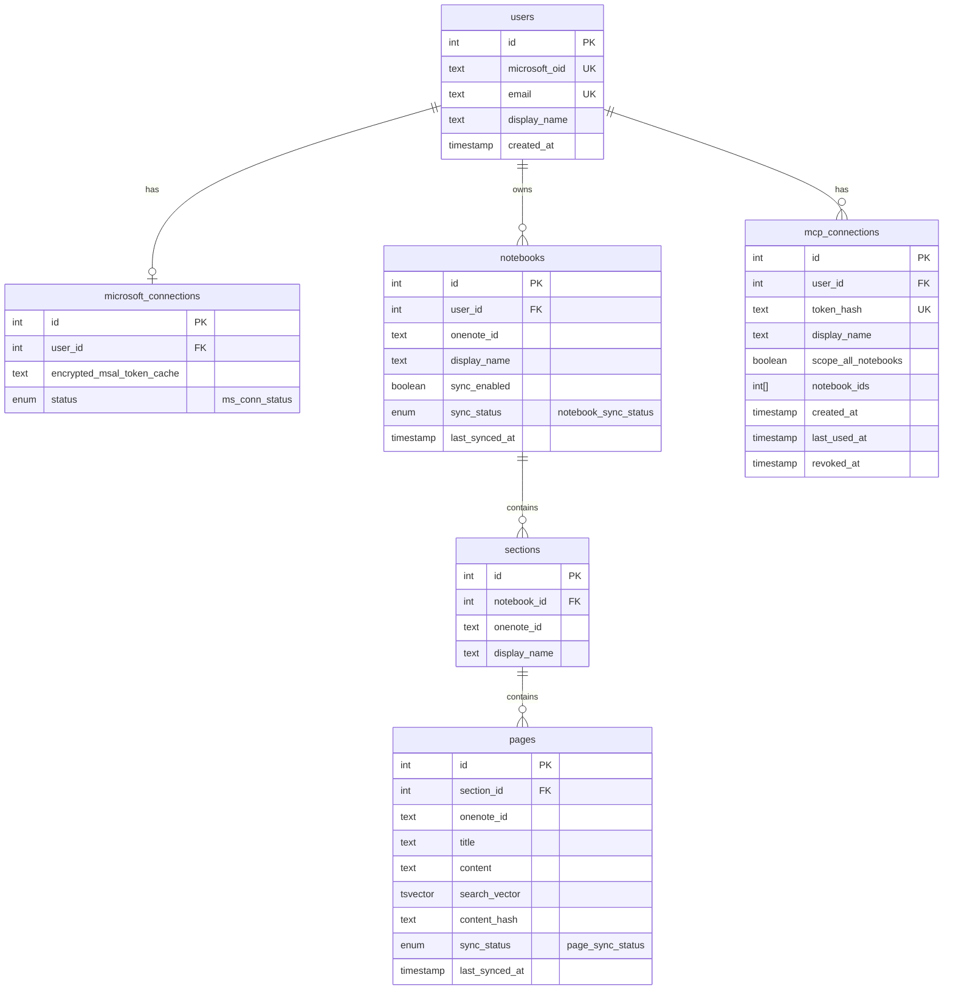

## Enum Values

**microsoft_connections.status**: `ACTIVE`, `NEEDS_REAUTH`

**notebooks.sync_status**: `PENDING`, `SYNCING`, `FRESH`, `FAILED` — **non-nullable**, default `PENDING`

**pages.sync_status**: `PENDING`, `SYNCING`, `FRESH`, `FAILED` — **non-nullable**, default `PENDING`

### Sync-status design (read before touching `sync_service`)

The status column answers exactly one question — *"how healthy is the last sync of this row?"* — with a concrete value at all times:

| value | meaning |
|---|---|
| `PENDING` | row discovered (name known) but never content-synced |
| `SYNCING` | a sync run is currently processing it |
| `FRESH` | last sync completed successfully |
| `FAILED` | last sync attempt errored |

Two earlier values were removed:

- **`STALE` is derived, never stored.** "Possibly out of date" is computed at read time from `SYNCING`/`FAILED` (the MCP's `_is_stale` helper). Storing it would mean a writer has to know to flip every row to stale on every relevant event — a maintenance trap. Keep it computed.
- **`EXCLUDED` is redundant with `notebooks.sync_enabled`.** Exclusion is a *user setting* (`sync_enabled = false`), orthogonal to sync health. Encoding it as a status created a second source of truth and forced the sync job to overwrite real status with `EXCLUDED`. A disabled notebook keeps whatever health status it last had; the UI renders "Disabled" off `sync_enabled`.

**Implementation consequence:** `sync_service` must write `FRESH` on success (it currently writes `None`), drop the block that sets `EXCLUDED` on disabled notebooks, and new rows default to `PENDING` instead of `NULL`. There is no `NULL` status anymore — `NULL`-means-fresh was an overload that conflated "never synced" with "synced fine." This keeps the only nullable status in the system on `microsoft_connections` (absence of a connection row), where `NULL` legitimately means "not connected."

---

## Column Justifications

### users
| column | reason |
|---|---|
| id | PK |
| microsoft_oid | Stable Microsoft account identifier from the MSAL `oid` claim. Email alone is not reliable since users can change it — `oid` is the only safe lookup key for returning OAuth users |
| email | Displayed in the web UI so the user can confirm which Microsoft account is connected |
| display_name | Displayed in the web UI |
| created_at | Useful for debugging |

### microsoft_connections
| column | reason |
|---|---|
| id | PK |
| user_id | FK to owner |
| encrypted_msal_token_cache | The sync cron job runs hours later with no user present. This encrypted blob is how it authenticates with Microsoft Graph — it contains the access and refresh tokens, and MSAL handles rotation automatically |
| status | `active` or `needs_reauth`. Set to `needs_reauth` by the sync job when Graph returns a 401, which surfaces a reconnect prompt in the web UI |

### notebooks
| column | reason |
|---|---|
| id | PK |
| user_id | FK to owner — all notebook queries are scoped by user |
| onenote_id | The Graph API identifier. Used in all Graph API calls and as the stable external reference. Unique per user |
| display_name | Shown in the UI for notebook listing and MCP connection scoping |
| sync_enabled | Core requirement — users can exclude notebooks from sync |
| sync_status | Lets the MCP server return a staleness warning and the UI show sync health per notebook |
| last_synced_at | Compared against Graph API's `lastModifiedDateTime` at sync time to decide whether the notebook needs reprocessing |

### sections
| column | reason |
|---|---|
| id | PK |
| notebook_id | FK — which notebook this section belongs to |
| onenote_id | Graph API identifier for the section. Used when traversing the notebook → section → page hierarchy during sync |
| display_name | Passed to the LLM in MCP results so it knows the section a page came from (e.g. "Work > Meetings > Q2 kickoff") |

### pages
| column | reason |
|---|---|
| id | PK |
| section_id | FK — pages belong to a section, which belongs to a notebook |
| onenote_id | Graph API identifier for the page. Used to fetch content and images. Unique per user |
| title | Included in MCP search results so the model knows which page a result came from |
| content | Combined text written by the sync job: typed text extracted from page HTML, interleaved with OCR text for pages with handwriting in the page's visual order. Kept as a single column because typed text and handwriting on real OneNote pages are spatially interleaved — splitting them into two columns would destroy ordering. Callers are informed via tool descriptions that this field mixes verbatim typed text with best-effort OCR output |
| search_vector | Pre-computed GIN-indexed `tsvector` over `content`. Makes full-text search a single indexed scan instead of a sequential `to_tsvector()` over all rows |
| content_hash | SHA-256 of the raw page content fetched from Graph. The sync job skips pages where this matches, avoiding unnecessary reprocessing |
| sync_status | Lets the MCP server flag stale pages in results |
| last_synced_at | Records when this page was last fully processed. Compared against Graph API's `lastModifiedDateTime` to detect changes |

### Search Indexes & Extensions

| object | purpose |
|---|---|
| `pg_trgm` extension | Enables trigram similarity matching. Required for fuzzy fallback on OCR errors (`painters` ↔ `pointers`, `Ivalve` ↔ `lvalue`) |
| `ix_pages_search_vector_gin` (GIN on `search_vector`) | Fast full-text search. First-pass match — high precision, fast |
| `ix_pages_content_trgm` (GIN with `gin_trgm_ops` on `content`) | Trigram index for fuzzy fallback when FTS misses an OCR-garbled term |

### mcp_connections
| column | reason |
|---|---|
| id | PK |
| user_id | FK to owner |
| token_hash | SHA-256 of the raw MCP token. Raw token is shown once and never stored |
| display_name | User-assigned label so they can tell connections apart ("Cursor laptop", "Claude Code") |
| scope_all_notebooks | When true, the connection sees all enabled notebooks. When false, `notebook_ids` is used |
| notebook_ids | `int[]` — list of notebook IDs in scope when `scope_all_notebooks = false`. No separate join table needed for V1 |
| created_at | Shown in the UI |
| last_used_at | Lets users see which connections are active before revoking |
| revoked_at | Soft delete — keeps the row so the hashed token stays in the table, preventing a deleted token from being reissued and matching a future hash |
