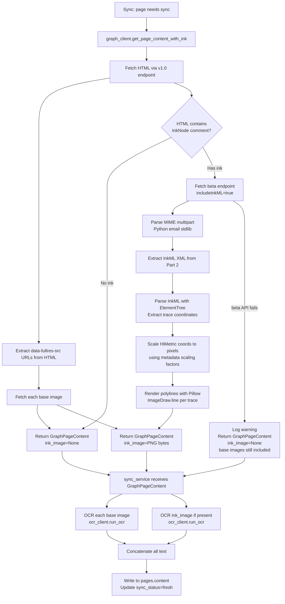

# Handwriting OCR Plan (Plan B — InkML)

## Background

The Microsoft Graph API does not expose handwritten content (ink strokes) as readable text. When fetching a OneNote page via `GET /me/onenote/pages/{id}/content`, any ink regions are replaced with:

```html
<!-- InkNode is not supported -->
```

There is no renderable image, no OCR result, and no extractable text at that location. Microsoft runs its own server-side OCR to power search inside the OneNote app, but that text is not accessible through any Graph API endpoint. The `previewText` field on page metadata is capped at 300 characters of typed text only — no handwriting.

This is a critical gap for this project. The user's notes are primarily:
- **Handwriting on top of PDF slides** — ink annotations overlaid on embedded slide images
- **Plain handwritten notes** — pure ink strokes on blank pages

---

## What the Graph API Gives Us

### 1. Base images (v1.0)

`GET /me/onenote/pages/{id}/content` returns HTML. Embedded images appear as:

```html

```

`data-fullres-src` is the full-resolution original — always used over `src` for OCR quality. For pages with ink-on-image (handwriting over a slide), the base image is the **clean slide only** — ink is not baked in.

### 2. Raw ink strokes (beta only)

`GET https://graph.microsoft.com/beta/me/notes/pages/{id}/content?includeInkML=true`

Returns a **MIME multipart response**:

- **Part 1** (`text/html`): Same HTML as above with `<!-- InkNode is not supported -->` placeholders
- **Part 2** (`application/inkml+xml`): All ink strokes for the page as InkML XML

InkML is a W3C standard. Each `<trace>` element is one pen stroke (pen-down to pen-up) encoded as a sequence of (x, y, pressure) samples:

```xml
<ink xmlns="http://www.w3.org/2003/InkML">
  <traceFormat>
    <channel name="X" type="decimal"/>
    <channel name="Y" type="decimal"/>
    <channel name="F" type="decimal"/>
  </traceFormat>
  <trace>
    452.3 201.1 0.8, 453.1 202.4 0.85, 454.0 204.2 0.9 ...
  </trace>
</ink>
```

OneNote uses **HiMetric units** (1/100 mm) for coordinates. The InkML metadata contains scaling factors to convert to real dimensions. A full handwritten page may have hundreds of traces.

---

## Why Not Composite Ink Onto Base Images?

Placing ink strokes visually over their slide would require:
1. Knowing where each image sits on the page (from HTML layout, in HiMetric units)
2. Mapping InkML stroke coordinates into that same space
3. Compositing correctly at pixel level

The coordinate space mapping is non-trivial and undocumented. More importantly, **spatial accuracy is irrelevant for search** — the MCP tools return page-level results. Whether a piece of handwriting was over slide 3 or slide 5 doesn't matter; only the text content does.

We process ink and base images **separately**, OCR both, and concatenate.

---

## Processing Pipeline



---

## Layer Responsibilities

### `graph_client.py` — owns all Graph API and InkML concerns

The graph client is responsible for returning ready-to-use data. The service never sees InkML XML, multipart responses, or image URL extraction — those are transport details.

**New public method:**

```python
async def get_page_content_with_ink(
    self, access_token: str, page_id: str
) -> GraphPageContent:
```

Returns a `GraphPageContent` with:
- `html: str` — raw page HTML (used by sync service for typed text extraction)
- `base_images: list[bytes]` — fetched from `data-fullres-src` URLs
- `ink_image: bytes | None` — InkML rendered to PNG, `None` if no ink or beta API fails

**Private methods (all inside `graph_client.py`):**

```python
def _extract_fullres_urls(self, html: str) -> list[str]:
    # regex over data-fullres-src attributes

async def _get_inkml(self, access_token: str, page_id: str) -> str | None:
    # hits beta endpoint, parses multipart with Python email stdlib
    # returns InkML XML string, None on failure

def _render_inkml(self, inkml_xml: str) -> bytes:
    # ElementTree parse → coordinate extraction → HiMetric scaling → Pillow render
    # returns PNG bytes
```

### `sync_service.py` — OCR and concatenation only

```python
content = await graph_client.get_page_content_with_ink(access_token, page_id)

text_parts: list[str] = []
for image in content.base_images:
    text_parts.append(ocr_client.run_ocr(image))
if content.ink_image:
    text_parts.append(ocr_client.run_ocr(content.ink_image))

page_text = "\n\n".join(filter(None, text_parts))
```

The service has no knowledge of InkML, multipart parsing, or image URL extraction.

---

## Strongly Typed Response

`GraphPageContent` lives in `schemas.py` under `# --- Client schemas ---`:

```python
class GraphPageContent(BaseModel):
    html: str
    base_images: list[bytes]
    ink_image: bytes | None
```

`bytes` fields are valid in Pydantic and appropriate here — this model is not serialised to JSON, it only crosses the client→service layer boundary for type safety.

---

## InkML Rendering Detail

**Why ElementTree + Pillow, not a dedicated library:**

Dedicated InkML libraries (`inkml2img`, `pinkml`, `universal-ink-library`) exist but are small, unmaintained projects that are unlikely to handle OneNote's specific HiMetric coordinate system and metadata correctly. We need control over the coordinate scaling — ElementTree is stdlib, Pillow is already a dependency, and we control the conversion logic.

**Rendering steps:**

1. Parse XML with `xml.etree.ElementTree`
2. Read `traceFormat` channels to confirm X/Y/F channel order
3. Read scaling metadata from `inkOrigin`, `inkExtent`, or similar attributes to determine HiMetric→pixel conversion
4. Find coordinate bounds across all traces (min/max X, min/max Y) to size the canvas
5. For each `<trace>`, split the coordinate string into (x, y) tuples, apply scaling
6. Use `Pillow ImageDraw.line(points, fill='black', width=2)` per trace
7. Return PNG bytes from `BytesIO`

The rendered image will not look exactly like the original (pen colour and style are not replicated) but OCR operates on shapes — text content is recoverable from black-on-white polylines.

---

## API Call Cost Per Page

| Page type | API calls |
|---|---|
| Typed text only | 1 (v1.0 HTML) + N image fetches |
| Typed text + images | 1 (v1.0 HTML) + N image fetches |
| Ink present | 2 (v1.0 HTML + beta InkML) + N image fetches |

v1.0 HTML is always fetched first — cheap, stable. Beta is only called when the InkNode comment is detected.

---

## Fallback Behaviour

If the beta endpoint fails (`GraphAPIError` raised):
- `_get_inkml` catches the error, logs a warning, returns `None`
- `get_page_content_with_ink` returns `GraphPageContent` with `ink_image=None`
- Sync continues — base images are still OCR'd and indexed
- Page is marked `sync_status=fresh` (partial content is better than a failed state)
- No user-facing error

---

## Dependencies

| Package | Purpose | Status |
|---|---|---|
| `Pillow` | Render InkML strokes to PNG | Needs adding to `pyproject.toml` (core, not optional) |
| `surya-ocr` | OCR rendered images | Already in `pyproject.toml` (optional group) |
| `httpx` | Fetch from Graph API | Already in `pyproject.toml` |
| `xml.etree.ElementTree` | Parse InkML XML | stdlib — no install needed |
| `email` | Parse MIME multipart beta response | stdlib — no install needed |

`Pillow` belongs in core dependencies (not the `ocr` optional group) because ink rendering is part of the main sync pipeline regardless of whether Surya OCR is installed.

---

## Known Limitations

| Limitation | Impact |
|---|---|
| Beta endpoint | May change or be removed without notice; fallback handles this |
| Ink not composited onto base images | Ink annotations not spatially associated with specific slides — text only |
| Pen style not replicated | Rendered ink is black polylines only |
| HiMetric scaling may need calibration | If metadata scaling is absent or wrong, coordinate mapping may be off |
| Very dense/overlapping handwriting | May reduce OCR accuracy |
