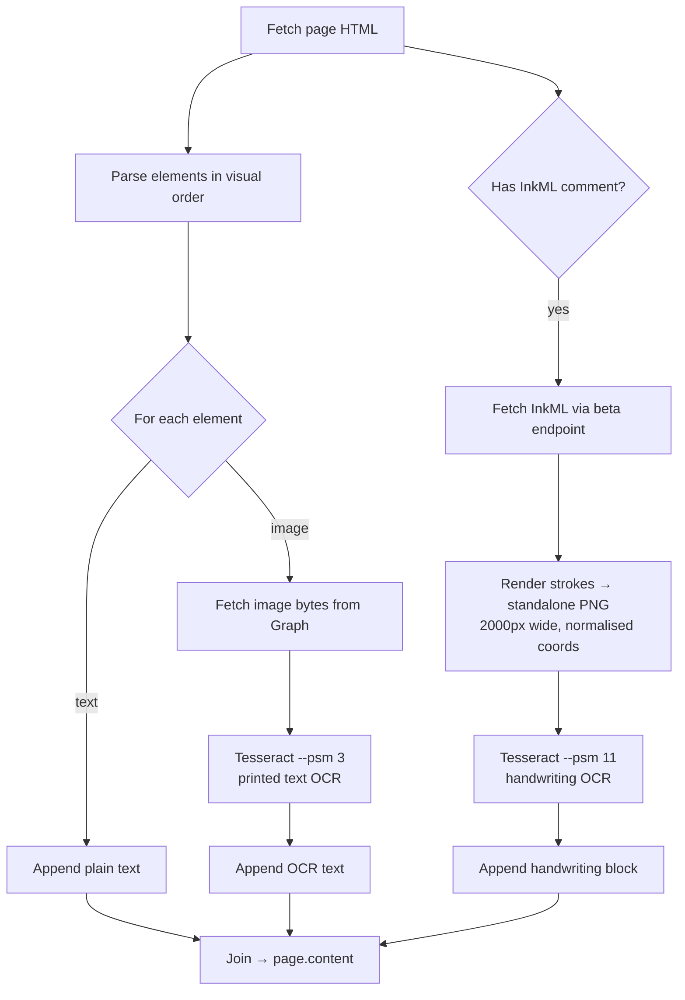
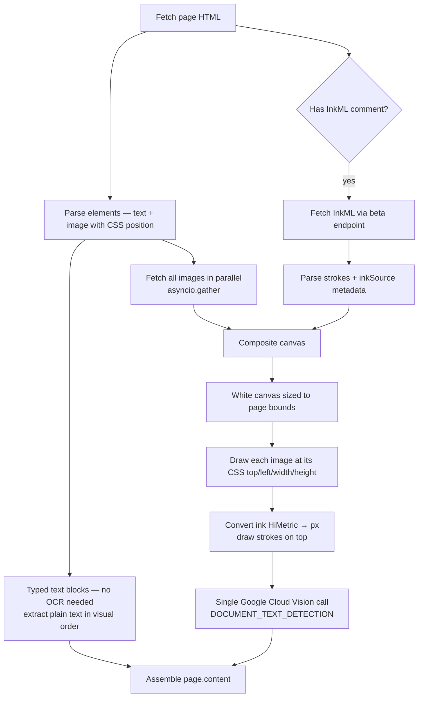
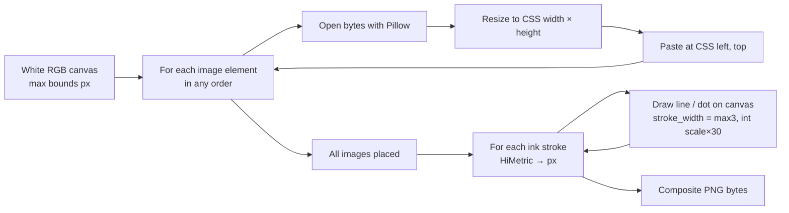
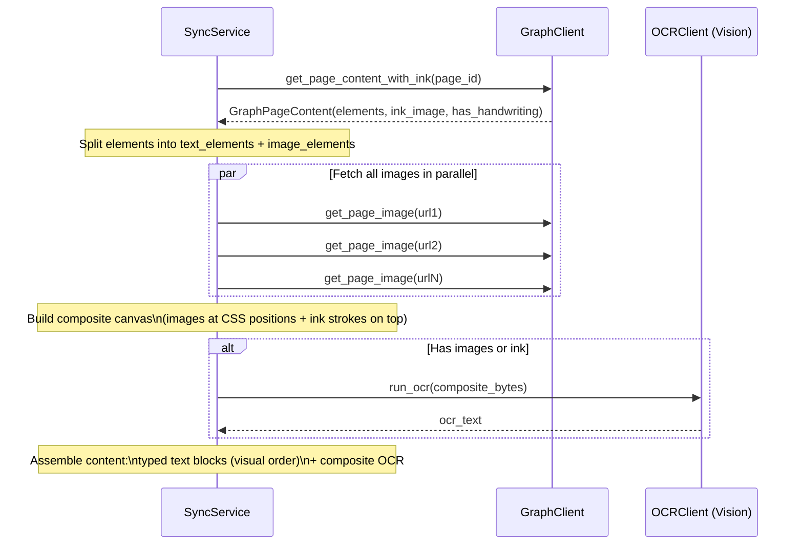

# Composite OCR Plan

Replace Tesseract with Google Cloud Vision and change from per-element OCR to a single composite image OCR per page.

---

## Why

**Tesseract problems:**
- Poor handwriting recognition quality
- Processes each image independently — no context about surrounding content
- Ink OCR'd in isolation from the slide it annotates

**What we want instead:**
- Ink strokes rendered *on top of* the slide images they annotate
- Single OCR call per page sees the full visual context
- Google Cloud Vision `DOCUMENT_TEXT_DETECTION` is purpose-built for dense document text + handwriting

---

## Current Pipeline



**Problems:** Ink is OCR'd out of context. Each slide image is OCR'd without knowing what ink sits on top of it. Two different Tesseract modes with conflicting tuning.

---

## Target Pipeline



---

## Coordinate System

### CSS pixels ↔ InkML HiMetric

OneNote HTML uses CSS `position:absolute` with `top`/`left`/`width`/`height` in **pixels at 96 DPI**.

InkML stores strokes in **HiMetric** units where 1 unit = 0.01 mm.

```
1 inch = 25.4 mm = 2540 HiMetric = 96 px (at 96 DPI)

px = himetric × 96 / 2540
   = himetric / 26.458
```

Both coordinate systems share the same **origin: top-left of the page**, so after unit conversion the ink strokes drop directly onto the CSS canvas with no additional offset.

> **Note:** The agent research mentioned `/ 914400` — that is EMU (English Metric Units used in OOXML). OneNote InkML uses HiMetric. Use `/ 26.458`.

### Canvas Sizing

The HTML does not always declare an explicit page size. Infer it:

```
canvas_width  = max(left + width  for all positioned elements)
canvas_height = max(top  + height for all positioned elements)
```

If `inkSource/activeArea` is present in the InkML XML it gives the ink canvas dimensions in HiMetric — convert and take `max` with the HTML-derived bounds as a safety check.

---

## Composite Canvas Algorithm



Key details:
- Images are pasted with `Image.paste()` at integer pixel offsets
- Stroke width formula (`max(3, int(scale × 30))`) from existing `_render_strokes` can be reused — but `scale` is now fixed at `96 / 2540` rather than normalised to output width
- Output at native page resolution (no forced 2000px width — let the page determine its own size)

---

## Render Scale

Render the composite at 2x (`_TARGET_RENDER_SCALE = 2.0`) to give Vision sharper strokes than 1x. Vision has a 75 MP hard cap per image and silently downscales anything larger (costing handwriting accuracy), so `composite_page(...)` adaptively clamps the render scale down for very tall pages:

```python
render_scale = min(_TARGET_RENDER_SCALE, sqrt(_MAX_RENDER_PIXELS / (base_w * base_h)))
```

This keeps the composite under Vision's per-image limit at all times.

**One OCR call per page.** Earlier experiments with tiling + parallel Vision calls produced marginal accuracy gains (~2% more characters recovered) at the cost of meaningfully more complexity (whitespace-aware splitting, per-tile orchestration, more network calls per sync). Not worth it for V1 — the simpler single-call pipeline is the design.

---

## Content Assembly

Typed text elements are already clean text — no need to OCR them. Images and ink are OCR'd together via the composite.

```
pages.content = typed text blocks + composite OCR text, interleaved in visual order
```

Typed and OCR text are kept in a **single `content` column**. On real OneNote pages, typed text is often spatially interleaved with handwriting — a typed heading above ink notes, typed bullets next to handwritten annotations, etc. Splitting into two columns would destroy that ordering. The combined `content` preserves the on-page narrative.

MCP tool descriptions inform the caller that `content` mixes verbatim typed text with best-effort OCR output, so the calling LLM can apply appropriate interpretation (especially for handwriting-heavy pages where OCR errors are likely).

The Vision API returns text in reading order within the image, so the composite OCR output is already roughly top-to-bottom, left-to-right. The `<handwriting>` wrapper tag is removed — ink and image text are one coherent block.

Pages with no images and no ink: composite is skipped, content is just the typed text (no Vision call).

---

## File-by-File Changes

### `app/schemas.py`

Add position fields to `GraphPageElement` — currently discarded after sorting, now kept for composite rendering:

```python
class GraphPageElement(BaseModel):
    kind: Literal["text", "image"]
    text: str | None = None
    image_url: str | None = None
    # Only set for kind="image"
    top: float = 0.0
    left: float = 0.0
    width: float = 0.0
    height: float = 0.0
```

No changes to `GraphPageContent`.

---

### `app/clients/graph_client.py`

**`_parse_page_elements`** — store image dimensions alongside the URL:

```python
# Currently:
positioned.append((top, left, GraphPageElement(kind="image", image_url=...)))

# After:
width  = _parse_css_px(style, "width")
height = _parse_css_px(style, "height")
positioned.append((top, left, GraphPageElement(
    kind="image", image_url=..., top=top, left=left, width=width, height=height
)))
```

**`_parse_inkml_strokes`** — also parse `inkSource/activeArea` (optional, used for canvas sizing):

```python
def _parse_inkml(inkml_xml: str) -> tuple[list[InkStroke], float, float]:
    """Returns (strokes, active_width_himetric, active_height_himetric).
    Width/height are 0.0 if inkSource/activeArea is absent."""
```

**New function `_composite_page`**:

```python
def _composite_page(
    elements: list[GraphPageElement],
    image_bytes_map: dict[str, bytes],  # image_url -> bytes
    ink_strokes: list[InkStroke],
) -> bytes | None:
    """
    Render images at their CSS positions, then draw ink strokes on top.
    Returns PNG bytes, or None if there are no images and no ink.
    """
```

Algorithm:
1. Compute `canvas_width`, `canvas_height` from element bounds (min 1×1)
2. If both are 0 and no strokes: return None
3. Create white RGB canvas
4. For each image element: open bytes, resize to `(int(elem.width), int(elem.height))`, paste at `(int(elem.left), int(elem.top))`
5. Convert each stroke point: `px = himetric / 26.458`
6. Draw strokes with `ImageDraw.line` (reuse stroke width logic from `_render_strokes`)
7. Return PNG bytes

**`get_page_content_with_ink`** stays the same signature — the composite is assembled in the sync service, not here. The graph client is responsible for fetching content, not rendering composites (separation of concerns).

---

### `app/clients/ocr_client.py`

Replace Tesseract with Google Cloud Vision. Single method — the composite handles the unified image, so we no longer need separate printed vs handwriting modes.

```python
from google.cloud import vision

class OCRClient:
    def __init__(self) -> None:
        self._client = vision.ImageAnnotatorClient()

    def run_ocr(self, image_bytes: bytes) -> str:
        image = vision.Image(content=image_bytes)
        response = self._client.document_text_detection(image=image)
        if response.error.message:
            raise RuntimeError(f"Vision API error: {response.error.message}")
        return response.full_text_annotation.text.strip()

@lru_cache
def get_ocr_client() -> OCRClient:
    return OCRClient()
```

`DOCUMENT_TEXT_DETECTION` (not `TEXT_DETECTION`) — designed for dense multi-column document text, preserves reading order, handles handwriting.

Authentication: `GOOGLE_APPLICATION_CREDENTIALS` env var pointing to a service account JSON file (standard GCP auth — the library picks it up automatically).

---

### `app/services/sync_service.py`

**`_sync_page_content`** — major refactor:



Key changes:
- Parallel image fetch: `asyncio.gather(*[self._graph_client.get_page_image(token, e.image_url) for e in image_elements])`
- Call `_composite_page(elements, image_bytes_map, strokes)` — need to decide where this lives (see below)
- Single `self._ocr_client.run_ocr(composite_bytes)` call
- Remove `<handwriting>` tag — ink and image text are now one block
- `ink_image` field on `GraphPageContent` is repurposed: we no longer render the ink standalone — we pass raw strokes to `_composite_page`. This means `GraphPageContent.ink_image` changes to `ink_strokes: list[InkStroke]`.

**Where does `_composite_page` live?**

Option A: `graph_client.py` — it works on graph-fetched data, keeps rendering logic next to the InkML/HTML parsing.
Option B: `sync_service.py` — it's called during sync, keeps the client as a pure API wrapper.

**Recommendation: `graph_client.py`** as a module-level function. It's pure image rendering, no network calls, and it's cohesive with the InkML rendering already there.

---

### `app/schemas.py` — `GraphPageContent`

```python
# Before:
class GraphPageContent(BaseModel):
    elements: list[GraphPageElement]
    ink_image: bytes | None       # pre-rendered standalone ink PNG
    has_handwriting: bool

# After:
class GraphPageContent(BaseModel):
    elements: list[GraphPageElement]
    ink_strokes: list[InkStroke]  # raw strokes, empty list if no ink
    has_handwriting: bool
```

The sync service composites the strokes with the images. The graph client no longer renders ink to a standalone PNG.

---

### `pyproject.toml`

```toml
# Remove:
"pytesseract",

# Add:
"google-cloud-vision",
```

Keep `pillow` — still used for composite rendering.

---

### `backend/.env.example`

```
# Google Cloud Vision
GOOGLE_CLOUD_VISION_API_KEY=your-api-key-here
```

Pass the key via `ClientOptions(api_key=key)` when constructing `ImageAnnotatorClient`. No service account JSON file needed — simpler for Railway deployment.

---

### `backend/nixpacks.toml`

```toml
# Remove:
[phases.setup]
nixPkgs = ["tesseract"]
```

No system packages needed. The Vision API client is pure Python + gRPC.

---

## Migration Steps

```mermaid
gantt
    title Implementation Order
    dateFormat  X
    axisFormat  %s

    section Schemas
    GraphPageElement add position fields   :a1, 0, 1
    GraphPageContent ink_strokes not bytes :a2, 0, 1

    section Graph Client
    _parse_page_elements store dimensions  :b1, 1, 2
    _parse_inkml return strokes + bounds   :b2, 1, 2
    Add _composite_page function           :b3, 2, 4
    Update get_page_content_with_ink       :b4, 2, 3

    section OCR Client
    Replace Tesseract with Vision API      :c1, 1, 2

    section Sync Service
    Parallel image fetch                   :d1, 4, 5
    Call _composite_page                   :d2, 4, 5
    Single OCR call + content assembly     :d3, 5, 6

    section Config
    pyproject.toml + nixpacks.toml         :e1, 0, 1
    .env.example + service account         :e2, 0, 1
```

**Order:**
1. `schemas.py` — foundation, everything else depends on it
2. `graph_client.py` — parse positions, expose raw strokes, add `_composite_page`
3. `ocr_client.py` — swap Tesseract for Vision API
4. `sync_service.py` — parallel fetch, composite, single OCR call
5. Config files — `pyproject.toml`, `nixpacks.toml`, `.env.example`

---

## Open Questions

| Question | Decision needed |
|---|---|
| Pages with no images AND no ink — skip OCR entirely? | Yes — composite returns None, content = typed text only |
| Pages with ink but no images — still composite? | Yes — ink on white canvas, OCR still useful |
| Stroke width in composite — fixed px or scaled? | Keep `max(3, int(96/2540 × stroke_diameter))` — TBD after visual test |
| Vision API key vs service account JSON? | **API key** — simpler for Railway, no JSON file to manage |
| Rate limiting — parallel pages across notebooks? | Vision API is 1800 req/min; `asyncio.Semaphore(10)` on page-level concurrency is safe |
