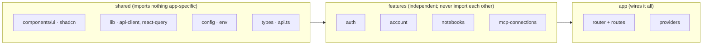
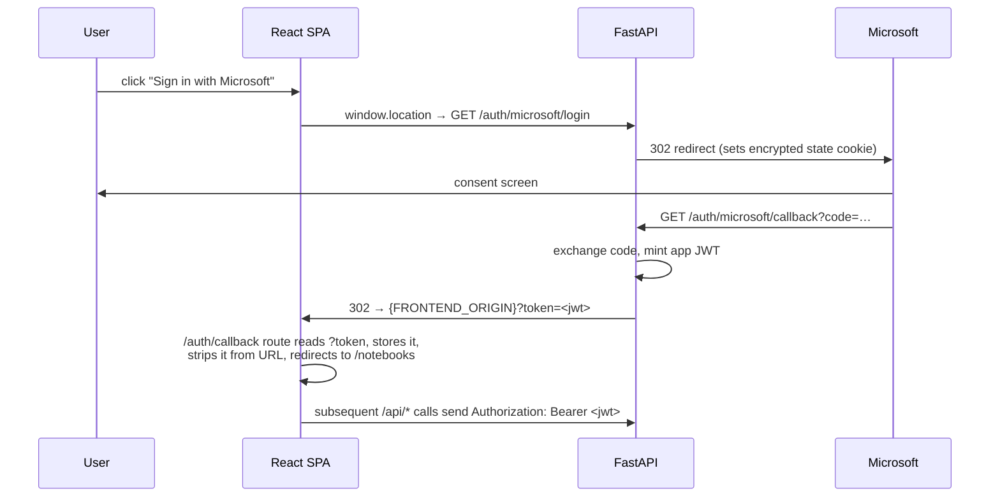
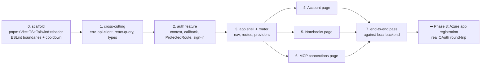

# Frontend Plan (Phase 2 — Local Frontend)

Build the React + Vite web UI on `localhost:5173` against the already-complete local backend on `localhost:8000`. This is **Phase 2** of `docs/plan.md`. The backend REST layer (`rest-api-plan.md`), MCP server, OAuth flow, and sync/OCR pipeline are all built and smoke-passing — this plan is purely the browser client that consumes them.

Scope is exactly the three pages `docs/plan.md` Phase 2 names — **Notebooks**, **MCP connections**, **Account** — plus the Microsoft sign-in flow that gates them.

---

## Why a feature-based structure (answering "what's the standard?")

The question was: *shared components at the top, a directory per view/page, hooks following the same pattern — is that standard?* **Yes — that instinct is the industry-standard "feature-based" (a.k.a. "screaming architecture") layout**, with one important refinement.

| Approach | Group by… | Good for | Verdict |
|---|---|---|---|
| **Type-based** | `components/`, `hooks/`, `pages/`, `api/` at the top, everything dumped in by kind | Tiny apps (<15–20 components) | Breaks down fast — editing one feature means touching four sibling folders |
| **Feature-based** | a folder per domain/feature; each owns its own components/hooks/api/types | Real apps, teams, anything that grows | **Recommended** — colocation, clear ownership, easy onboarding |

The refinement to the original idea: **don't put a top-level `hooks/` directory that mirrors the views.** Hooks, API calls, and types that belong to one view live *inside that view's feature folder*. The top-level folders (`components/`, `hooks/`, `lib/`, `types/`) hold **only genuinely cross-cutting** code — a `Button` used everywhere, the axios client, the API type definitions. This is the [bulletproof-react](https://github.com/alan2207/bulletproof-react/blob/master/docs/project-structure.md) convention, and it enforces one rule that keeps the codebase clean as it grows:

```
unidirectional imports:  shared  →  features  →  app
```

- **shared** (`components/`, `lib/`, `hooks/`, `config/`, `types/`) imports from nothing app-specific.
- **features** import from shared, **never from each other** (enforced by an ESLint `import/no-restricted-paths` boundary).
- **app** (router, providers) is the only layer that wires features together.

Two more current-practice notes that differ from older guides:
- **No barrel files** (`index.ts` re-exporting a whole folder). They defeat Vite's tree-shaking and slow dev startup — import modules directly (`features/notebooks/api/use-notebooks.ts`), not through an aggregator.
- **Anti-corruption wrapping** of third-party UI: shadcn/ui components are *copied into* `components/ui/` (that's how shadcn works — you own the source), so library churn is already contained.



---

## Tech stack (already decided in `docs/plan.md`)

No new decisions here — `docs/plan.md` → "Frontend Packages" already locks these in. This plan just puts them to work.

| Package | Role | Notes |
|---|---|---|
| Vite + React + TypeScript | Build + framework + types | `pnpm create vite frontend --template react-ts` |
| Tailwind CSS | Styling | utility-first; configured via Vite plugin |
| shadcn/ui (Radix) | Accessible component primitives | copied into `components/ui/`, owned in-repo |
| React Router | Client routing | `createBrowserRouter` (data-router API) |
| TanStack Query | **Server state** — fetching, caching, refetch, mutations | the source of truth for all `/api/*` data |
| Axios | HTTP client | single configured instance + interceptors |

> **State split:** TanStack Query owns *server* state (notebooks, connections, profile — anything that lives in the DB). React Context owns the small amount of *client* state — just the auth session (the JWT). We deliberately do **not** add Redux/Zustand for V1; there's no client-only state beyond auth.

> **Package manager: pnpm** (not npm). Chosen for the supply-chain cooldown below — pnpm supports a *rolling minimum release age* with per-package exclusions, and blocks install scripts by default. Use `pnpm` for every command in this plan.

---

## Supply-chain hygiene (set up in the scaffold step)

The backend already enforces a **dependency cooldown** via uv (`backend/pyproject.toml` → `[tool.uv] exclude-newer = "1 week"`): a rolling 7-day window so a freshly-published (possibly compromised) version can't be installed until it's had a week to be flagged/yanked. Mirror that on the frontend so both halves of the stack have symmetric protection.

1. **Rolling cooldown** — in `pnpm-workspace.yaml`:

   ```yaml
   pnpm:
     minimumReleaseAge: 10080          # minutes = 7 days; the uv "1 week" analog
     minimumReleaseAgeExclude:         # fast-track trusted pkgs / urgent security fixes
       - "@types/*"
   ```
   Most npm supply-chain payloads are detected and removed within hours, so a 7-day delay filters nearly all of them. The `Exclude` list is the escape hatch for a genuine security patch you don't want to wait on.

2. **Frozen, reproducible installs** — commit `pnpm-lock.yaml`; CI and teammates install with `pnpm install --frozen-lockfile` (the `npm ci` equivalent). The cooldown picks the version; the lockfile pins it.

3. **Block install scripts by default** — pnpm 10+ does this already; allowlist only the few build-time deps that need it (Vite's `esbuild`, etc.) via `onlyBuiltDependencies` in `pnpm-workspace.yaml`. Postinstall scripts are the #1 malware delivery vector, so this matters as much as the cooldown.

4. **Audit on top** — `pnpm audit` in CI; the cooldown is probabilistic (only protects against malware caught *within* the window), not a guarantee.

---

## Directory structure (mapped to this app)

```
frontend/
├── index.html
├── vite.config.ts
├── tsconfig.json
├── tailwind.config.ts
├── .env.local                      # VITE_API_BASE_URL=http://localhost:8000
├── components.json                 # shadcn config
└── src/
    ├── main.tsx                    # ReactDOM root → <AppProvider><RouterProvider/>
    ├── app/
    │   ├── provider.tsx            # QueryClientProvider + AuthProvider + Toaster
    │   ├── router.tsx              # createBrowserRouter route table
    │   └── routes/
    │       ├── account.tsx         # thin route wrappers — compose feature pages
    │       ├── notebooks.tsx
    │       ├── mcp-connections.tsx
    │       └── auth-callback.tsx   # lands on ?token=… , stores it, redirects
    ├── components/
    │   ├── ui/                     # shadcn primitives: button, card, dialog, switch, badge…
    │   └── layout/
    │       ├── app-shell.tsx       # nav + <Outlet/> for authenticated pages
    │       └── nav.tsx
    ├── config/
    │   └── env.ts                  # typed access to import.meta.env (fail fast if missing)
    ├── hooks/                      # ONLY cross-cutting hooks (e.g. use-copy-to-clipboard)
    ├── lib/
    │   ├── api-client.ts           # axios instance + auth header + 401 interceptor
    │   └── react-query.ts          # configured QueryClient (defaults, retry policy)
    ├── types/
    │   └── api.ts                  # TS mirror of backend response/request schemas
    └── features/
        ├── auth/
        │   ├── auth-context.tsx    # JWT in context (+ localStorage persistence)
        │   ├── components/
        │   │   ├── protected-route.tsx     # redirects to login if no token
        │   │   └── sign-in-button.tsx      # → window.location = /auth/microsoft/login
        │   └── hooks/use-auth.ts
        ├── account/
        │   ├── api/use-me.ts                # GET /api/me   (useQuery)
        │   ├── api/use-disconnect.ts        # POST /auth/microsoft/disconnect (useMutation)
        │   ├── components/
        │   │   ├── account-page.tsx
        │   │   ├── microsoft-status-card.tsx   # Connect / Connected / Reconnect
        │   │   └── reauth-banner.tsx
        │   └── types.ts             # only if a feature-local type is needed
        ├── notebooks/
        │   ├── api/use-notebooks.ts         # GET /api/notebooks
        │   ├── api/use-toggle-sync.ts       # PATCH /api/notebooks/{id} (optimistic)
        │   ├── api/use-refresh-notebooks.ts # POST /api/notebooks/refresh
        │   ├── components/
        │   │   ├── notebooks-page.tsx
        │   │   ├── notebook-row.tsx          # toggle + sync-status badge
        │   │   ├── sync-status-badge.tsx
        │   │   └── refresh-button.tsx
        │   └── lib/sync-status.ts            # status → label/variant render contract
        └── mcp-connections/
            ├── api/use-connections.ts        # GET /api/mcp-connections
            ├── api/use-create-connection.ts  # POST /api/mcp-connections
            ├── api/use-revoke-connection.ts  # DELETE /api/mcp-connections/{id}
            ├── components/
            │   ├── connections-page.tsx
            │   ├── connection-list.tsx
            │   ├── create-connection-dialog.tsx
            │   └── token-reveal-panel.tsx     # the "shown once" raw_token + mcp_url
            └── types.ts
```

> **Why three layers (`app` / `features` / shared) for only three pages?** The structure is cheap now and saves a painful reshuffle later (page-viewer, sections browse, settings are all plausibly next — see `rest-api-plan.md` "Out of scope"). It also makes each page reviewable in isolation. For a 3-page app you won't use every per-feature subfolder — include only what a feature needs (e.g. `account` has no `lib/`).

---

## Cross-cutting layers (build these first)

### `lib/api-client.ts` — axios instance + interceptors

A single configured axios instance is the choke point for auth and error handling. Two interceptors:

```ts
// Request: attach the app JWT (from auth context's persisted value) as Bearer.
client.interceptors.request.use((config) => {
  const token = getStoredToken();               // localStorage-backed
  if (token) config.headers.Authorization = `Bearer ${token}`;
  return config;
});

// Response: 401 → session is dead, clear token + redirect to login.
// This is THE place the "401 means re-authenticate" contract from rest-api-plan lives.
client.interceptors.response.use(
  (r) => r,
  (error) => {
    if (error.response?.status === 401) {
      clearStoredToken();
      window.location.assign("/login");          // or route the SPA to a login screen
    }
    return Promise.reject(error);
  },
);
```

> **The 401-vs-403 contract from `rest-api-plan.md` is load-bearing here.** The interceptor keys re-login off **401 only**. A **403** (authenticated but not your resource) must *not* trigger logout — it surfaces as an inline error. A **400** (`InvalidRequestError`, e.g. invalid `notebook_ids`) and **422** (Pydantic schema violation) are both user-fixable form errors. The mutation hooks read `error.response.data.detail` for the message.

### `lib/react-query.ts` — QueryClient

Sensible V1 defaults: `staleTime` ~30s (notebooks/connections don't change second-to-second), retry off for 4xx (a 403/404 won't fix itself on retry), one retry for network blips. Mutations invalidate the relevant query key on success.

### `config/env.ts` — typed env, fail fast

```ts
const API_BASE_URL = import.meta.env.VITE_API_BASE_URL;
if (!API_BASE_URL) throw new Error("VITE_API_BASE_URL is not set");
export const env = { API_BASE_URL } as const;
```

CORS is already handled backend-side (`main.py` binds `allow_origins=[settings.FRONTEND_ORIGIN]`, `allow_credentials=True`) — just make sure backend `FRONTEND_ORIGIN=http://localhost:5173` matches the Vite dev port.

### `types/api.ts` — keep in lockstep with the backend

The backend is FastAPI, so it publishes an OpenAPI schema at `http://localhost:8000/openapi.json`. **Recommended: generate the TS types** rather than hand-writing them, so the frontend can't silently drift from `app/schemas.py`:

```bash
pnpm dlx openapi-typescript http://localhost:8000/openapi.json -o src/types/api.ts
```

Wire it as a `pnpm gen:api` script and regenerate whenever backend schemas change. (Hand-writing the ~6 response shapes is also fine for V1 if you'd rather not add the dep — but codegen is the standard for a typed client against a typed backend.) The shapes the UI consumes:

| Type | Fields the UI uses |
|---|---|
| `MeResponse` | `email`, `display_name`, `microsoft_status` (`null \| "ACTIVE" \| "NEEDS_REAUTH"`) |
| `NotebookWebResponse` | `id`, `display_name`, `sync_enabled`, `sync_status`, `last_synced_at` |
| `MCPConnectionWebResponse` | `id`, `display_name`, `scope_all_notebooks`, `notebook_ids`, `created_at`, `last_used_at`, `revoked_at` |
| `MCPConnectionCreatedResponse` | `raw_token`, `mcp_url` (+ above) — **only** from POST, shown once |

---

## The auth flow (the one piece that spans frontend + backend)

The backend already implements the whole OAuth dance; the SPA's job is small but must be exact.



Implementation specifics:
1. **Sign-in is a full-page navigation, not fetch** — `window.location.assign(`${API_BASE_URL}/auth/microsoft/login`)`. OAuth redirects can't be followed by XHR.
2. **Token capture** — the backend lands the browser back at `{FRONTEND_ORIGIN}?token=<jwt>` (`auth.py:61`). The `auth-callback` route parses `token` from the query string, hands it to the auth context, **immediately strips it from the URL** (`window.history.replaceState`) so it doesn't sit in history/bookmarks, then navigates to `/notebooks`.
3. **Storage** — auth context is the source of truth, persisted to `localStorage` so a refresh doesn't force re-login. (XSS tradeoff acknowledged for a local V1; the backend uses Bearer-header auth, not cookies, so localStorage is the matching choice. An httpOnly-cookie model would be a backend change, out of scope here.)
4. **ProtectedRoute** — wraps the three pages; if there's no token, redirect to a minimal `/login` screen whose only content is the sign-in button.
5. **Disconnect / reconnect** — `POST /auth/microsoft/disconnect` (Bearer-protected, 204) on the Account page; "reconnect" (when `microsoft_status === "NEEDS_REAUTH"`) just re-runs the same `/auth/microsoft/login` navigation, per `rest-api-plan.md` ("no new endpoint needed").

> **One backend coordination flag (security nicety, optional):** the token currently arrives in the **query string** (`?token=`), which is sent to servers and can land in access logs. The SPA stripping it on arrival mitigates this, but switching the backend redirect to a **URL fragment** (`#token=`, never sent to the server) would be strictly safer. Not required for local V1 — noting it so it's a conscious choice, not an oversight. (Tracked against `auth.py:61`.)

---

## Page-by-page (each maps 1:1 to a feature folder)

### Account (`features/account`)
- `GET /api/me` via `use-me` → render profile + a **Microsoft status card** driven entirely by `microsoft_status`:

  | `microsoft_status` | Card state |
  |---|---|
  | `null` | "Connect your Microsoft account" → sign-in button |
  | `"ACTIVE"` | "Connected" + Disconnect button |
  | `"NEEDS_REAUTH"` | **Reconnect** banner — refresh token died; re-run login |
- Disconnect mutation invalidates the `me` query.

### Notebooks (`features/notebooks`)
- `GET /api/notebooks` → one `notebook-row` per notebook. The **render contract** (lifted verbatim from `rest-api-plan.md`) lives in `lib/sync-status.ts`:

  | `sync_enabled` | `sync_status` | UI |
  |---|---|---|
  | `false` | *(any)* | "Disabled" — toggle off, ignore status |
  | `true` | `PENDING` | "Not synced yet" |
  | `true` | `SYNCING` | "Syncing…" spinner |
  | `true` | `FRESH` | "Synced · {last_synced_at}" |
  | `true` | `FAILED` | "Sync failed" error badge |
- **Toggle** → `PATCH /api/notebooks/{id}` (204). Use an **optimistic update** (flip the switch instantly, roll back on error) since it's a deterministic single-field change — TanStack Query's `onMutate`/`onError` pattern.
- **Refresh button** → `POST /api/notebooks/refresh`, then invalidate the notebooks query. Per `rest-api-plan.md`, **gate the button on `microsoft_status`**: disabled when `null`/`NEEDS_REAUTH`; the `409 ConflictError` is the backend's honest fallback if the connection died between load and click (surface it as a toast).

### MCP connections (`features/mcp-connections`)
- `GET /api/mcp-connections` → list with scope, created/last-used, and a Revoke button per row (`revoked_at` rows shown as revoked/disabled).
- **Create** (`create-connection-dialog`): name + scope choice (all notebooks vs. pick a subset — the subset list comes from the notebooks query). `POST` returns `MCPConnectionCreatedResponse`.
- **The "show once" panel** (`token-reveal-panel`) is the security-critical UI: `raw_token` + `mcp_url` are displayed **exactly once**, with copy buttons and a clear "you won't see this again" warning. After dismiss it's gone — subsequent list reads never include token material (the backend's `response_model` guarantees this). Revoke → `DELETE /api/mcp-connections/{id}` (204), invalidate the list.

---

## File-by-file summary

| File / area | Action | Notes |
|---|---|---|
| project scaffold | new | pnpm + Vite react-ts, Tailwind, shadcn init, ESLint + `import/no-restricted-paths` boundary; `pnpm-workspace.yaml` with `minimumReleaseAge: 10080` + `onlyBuiltDependencies` (supply-chain cooldown, mirrors backend uv `exclude-newer`) |
| `config/env.ts` | new | typed `VITE_API_BASE_URL`, fail-fast |
| `lib/api-client.ts` | new | axios instance, Bearer request interceptor, **401** response interceptor |
| `lib/react-query.ts` | new | `QueryClient` defaults (staleTime, no-retry-on-4xx) |
| `types/api.ts` | new | `openapi-typescript` codegen from `/openapi.json` (or hand-written) |
| `app/provider.tsx` · `app/router.tsx` · `main.tsx` | new | providers + `createBrowserRouter` + root |
| `components/ui/*` | new | shadcn primitives (button, card, dialog, switch, badge, sonner/toast) |
| `components/layout/*` | new | app shell + nav |
| `features/auth/*` | new | context, `protected-route`, `sign-in-button`, `use-auth`, callback handling |
| `features/account/*` | new | `use-me`, `use-disconnect`, status card, reauth banner |
| `features/notebooks/*` | new | list/toggle/refresh hooks, row, status badge, render-contract lib |
| `features/mcp-connections/*` | new | list/create/revoke hooks, dialog, **token-reveal panel** |
| backend `auth.py:61` | flag only | optional `?token=` → `#token=` hardening (decide, don't silently keep) |

---

## Sequencing



Do **cross-cutting + auth first** — every page depends on the api-client and a valid session. The three pages are independent after the shell exists and can be built in any order (or parallelized). The real Microsoft OAuth round-trip can't be fully exercised until **Phase 3 (Azure app registration)**, which `docs/plan.md` says to do *during* this phase — register the app early so the sign-in flow is testable end-to-end as you build the Account page. Until then, mint a dev JWT (`create_jwt`, as `scripts/smoke_rest.py` does) and drop it into the auth context to develop the authenticated pages.

---

## Acceptance criteria

- [ ] `pnpm dev` serves the SPA on `localhost:5173`; it talks to `localhost:8000` with no CORS errors.
- [ ] Unauthenticated visit to any of the three pages redirects to the login screen.
- [ ] Sign-in button performs a full-page redirect to `/auth/microsoft/login`; the callback captures `?token`, strips it from the URL, and lands on Notebooks authenticated.
- [ ] A **401** from any `/api/*` call clears the session and returns to login; a **403/404/400** does **not** log the user out (shown inline).
- [ ] **Account** renders the right state for each `microsoft_status` (null / ACTIVE / NEEDS_REAUTH); disconnect works and the card updates.
- [ ] **Notebooks** lists all notebooks (incl. disabled) with the correct status label per the render contract; toggling persists (optimistic, survives reload); Refresh repopulates and is gated on `microsoft_status`.
- [ ] **MCP connections** creates a connection, shows `raw_token` + `mcp_url` **once** with copy + warning, lists existing connections with **no** token material, and revokes.
- [ ] No feature imports another feature (ESLint boundary passes); no barrel-file re-exports.

---

## Out of scope (deferred to later phases)

- **Page/section content browsing in the web UI** — that's the MCP's job (`rest-api-plan.md` defers `/api/sections`,`/api/pages`). The web app manages settings, not reading.
- **httpOnly-cookie auth** — would be a backend change; Bearer-in-header + localStorage is the V1 model.
- **Edit/rename MCP connection** — create + revoke covers V1.
- **Dark mode, i18n, e2e test suite (Playwright)** — nice-to-haves, not Phase 2 gates.
- **Deployment (Vercel/Cloudflare Pages)** — Phase 4.

---

Sources for the structure conventions: [bulletproof-react project structure](https://github.com/alan2207/bulletproof-react/blob/master/docs/project-structure.md), [Robin Wieruch — React Folder Structure 2026](https://www.robinwieruch.de/react-folder-structure/).
