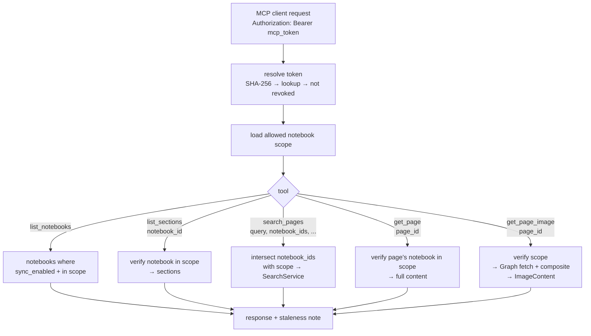
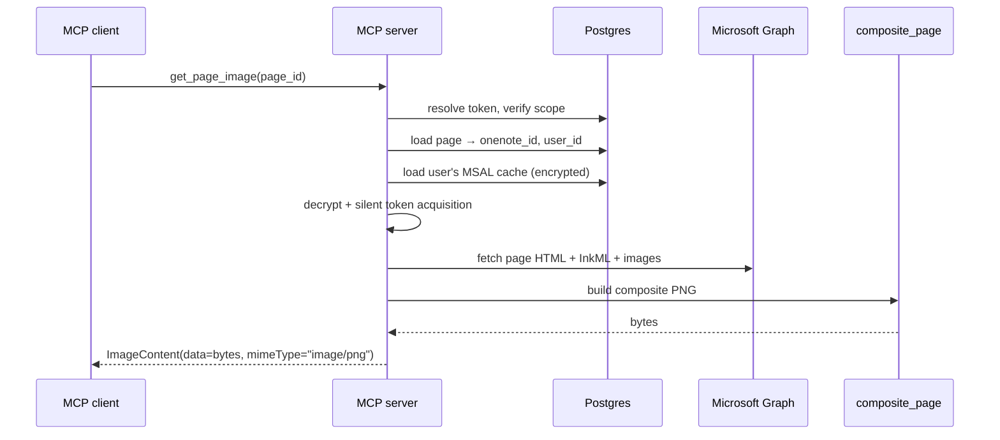
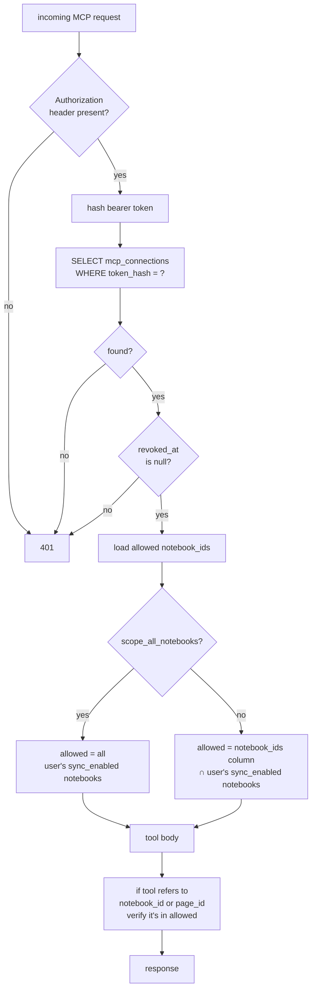

# MCP Server Plan

Stand up the FastMCP server mounted into the existing FastAPI ASGI app and implement the five read-only tools that MCP clients (Cursor, Claude Code, Codex) will call.

---

## Why

This is the user-facing surface of the project. Everything we've built (sync, OCR, search) exists to feed these tools. The design balances:
- **Context efficiency** — `search_pages` returns short tagged snippets, not full pages
- **Caller control** — `notebook_ids` is required so callers narrow scope before searching
- **Escape hatch** — `get_page_image` is available but opt-in (large context cost)

---

## Tool Surface



All tools share three concerns:
1. **Token auth** — resolve the bearer token; fail 401 if revoked or unknown
2. **Notebook scope enforcement** — every page/notebook ID a caller references must intersect the connection's allowed scope
3. **Staleness signaling** — if any in-scope notebook is currently `syncing` or `failed`, or the page itself isn't `fresh`, include a note in the response

---

## Tool Specs

### `list_notebooks()`

Returns notebooks the caller can see — `sync_enabled = true` and in the connection's scope.

```python
class NotebookSummary(BaseModel):
    id: int
    display_name: str
    sync_status: Literal["fresh", "syncing", "stale", "failed", "excluded"]
    last_synced_at: datetime | None

@mcp.tool
async def list_notebooks() -> list[NotebookSummary]: ...
```

Intended as the **first call** by a new MCP session, so the caller can pick notebook IDs to scope `search_pages`.

### `list_sections(notebook_id: int)`

Returns sections within a notebook — verified to be in scope.

```python
class SectionSummary(BaseModel):
    id: int
    display_name: str

@mcp.tool
async def list_sections(notebook_id: int) -> list[SectionSummary]: ...
```

### `search_pages(...)`

Wraps `SearchService.search`. Required `notebook_ids` — callers narrow scope before searching.

```python
@mcp.tool
async def search_pages(
    query: str,
    notebook_ids: list[int],
    search_size: int = 80,          # max 250
    max_pages: int = 10,            # max 20
    max_snippets_per_page: int = 5, # max 10
) -> SearchResponse: ...
```

**Tool description (visible to the calling LLM)** must include the warning:

> Page content mixes verbatim typed text with best-effort OCR output. OCR portions may contain recognition errors (e.g. `painters` for `Pointers`). The search uses fuzzy matching to tolerate these errors. If you need to read a page faithfully, use `get_page_image`.

```python
class SearchResponse(BaseModel):
    hits: list[SearchHit]   # from search_service
    stale: bool             # any in-scope notebook syncing/failed?
    stale_note: str | None  # human-readable explanation when stale
```

### `get_page(page_id: int)`

Returns the full combined `content` for a page (typed + OCR in visual order). Verify the page's notebook is in scope.

```python
class PageContent(BaseModel):
    page_id: int
    page_title: str | None
    section_name: str
    notebook_id: int
    notebook_name: str
    content: str
    stale: bool
    stale_note: str | None

@mcp.tool
async def get_page(page_id: int) -> PageContent: ...
```

Same content-warning as `search_pages` belongs in the tool description.

### `get_page_image(page_id: int)`

Escape hatch. Re-fetches the page from Graph, composites images + ink, returns the PNG as MCP `ImageContent`.

```python
@mcp.tool
async def get_page_image(page_id: int) -> ImageContent: ...
```

For V1, **re-render on demand** rather than caching. Each call costs a Graph API roundtrip + composite render. Tool description should mention this is for cases where OCR is insufficient and warn callers about context cost.



This means `get_page_image` needs the same Graph + MSAL stack the sync service uses. The MSAL silent acquisition should **not** write back to the DB in this path (read-only tool) — same pattern as `scripts/test_ocr.py` already uses.

---

## File-by-File Changes

### `app/mcp/__init__.py` (new)

Empty marker for the package.

### `app/mcp/server.py` (new)

- Create `FastMCP` instance
- Wire dependencies (DB session, MSAL client, Graph client, SearchService, …) via FastMCP dependency injection or a context object
- Export the FastMCP ASGI app for mounting

### `app/mcp/auth.py` (new)

- `resolve_mcp_token(token: str) -> ResolvedMCPConnection` — SHA-256 hash, look up in `mcp_connections`, fail on revoked/not-found, return connection with allowed `notebook_ids` (or "all notebooks for this user" when `scope_all_notebooks`)
- Updates `last_used_at` on success (fire-and-forget — don't block the response)

### `app/mcp/tools.py` (new)

Five tool implementations as above. Each:
1. Calls `resolve_mcp_token` (via FastMCP's auth header injection)
2. Verifies notebook scope for any IDs the caller passed
3. Delegates to the relevant service (`SearchService`, `NotebookService`, `MCPConnectionService`)
4. Checks staleness and wraps the response

### `app/main.py`

Mount FastMCP at `/mcp`:

```python
from app.mcp.server import mcp_app

app = FastAPI(...)
app.mount("/mcp", mcp_app)
```

### `app/services/mcp_connection_service.py` (new — already in build plan)

Already in todo. The MCP server needs `resolve_token` from here. Pull this into scope of this plan.

```python
class MCPConnectionService:
    async def resolve_token(self, token: str) -> ResolvedMCPConnection: ...
    async def create(self, user_id: int, scope_all_notebooks: bool, notebook_ids: list[int] | None, display_name: str) -> tuple[MCPConnection, str]: ...
    async def list_for_user(self, user_id: int) -> list[MCPConnection]: ...
    async def revoke(self, user_id: int, connection_id: int) -> None: ...
```

### `app/services/notebook_service.py` (new — already in build plan)

```python
class NotebookService:
    async def list_for_scope(self, user_id: int, scope: ResolvedMCPConnection) -> list[NotebookSummary]: ...
    async def list_sections(self, notebook_id: int, scope: ResolvedMCPConnection) -> list[SectionSummary]: ...
```

---

## Auth & Scope Enforcement Detail



Every page/notebook ID the caller references is checked against `allowed` before any work happens. This prevents callers from poking at IDs outside their scope by guessing them.

---

## Staleness Note

If any in-scope notebook has `sync_status ∈ {syncing, stale, failed}` or the relevant page has `sync_status != fresh`, attach:

```
{
  "stale": true,
  "stale_note": "Notebook 'CS 246' is currently syncing. Results may be incomplete."
}
```

For `search_pages` the note is per-response. For `get_page` / `get_page_image` it's per-page.

---

## Acceptance Criteria

- [ ] FastMCP mounted at `/mcp` on the FastAPI app
- [ ] MCP client (Claude Code or `mcp-cli`) can connect with a bearer token from `POST /api/mcp-connections`
- [ ] `list_notebooks` returns only notebooks in the connection's scope, regardless of how many notebooks the user owns
- [ ] `search_pages` with notebook IDs outside the connection's scope returns 0 hits for the out-of-scope IDs (or errors clearly)
- [ ] `search_pages` against the CS246 test page returns snippets including OCR'd words (proves end-to-end search service hookup)
- [ ] `get_page` returns full content including the typed text and OCR text interleaved
- [ ] `get_page_image` returns PNG bytes via MCP `ImageContent`, recomputed live from Graph + composite (verify in MCP client that the image renders)
- [ ] Revoking a connection (set `revoked_at`) immediately causes 401 on subsequent tool calls
- [ ] Staleness note appears when any in-scope notebook is mid-sync

---

## Dependencies

- **Depends on** `search-service-plan.md` — `search_pages` requires `SearchService` and the `pg_trgm` index
- **Depends on** sync running at least once — there must be some `pages` with content to search
- **Independent of** `tiling-walkback-plan.md` — MCP server doesn't care how OCR text got there

---

## Out of Scope (for this plan)

- Web UI for creating/revoking MCP connections (separate frontend phase)
- The `routers/mcp_connections.py` REST endpoints (separate; uses the same service)
- Caching of page images (V2 — on-demand re-render is fine for V1)
- Rate limiting per MCP connection (V2)
