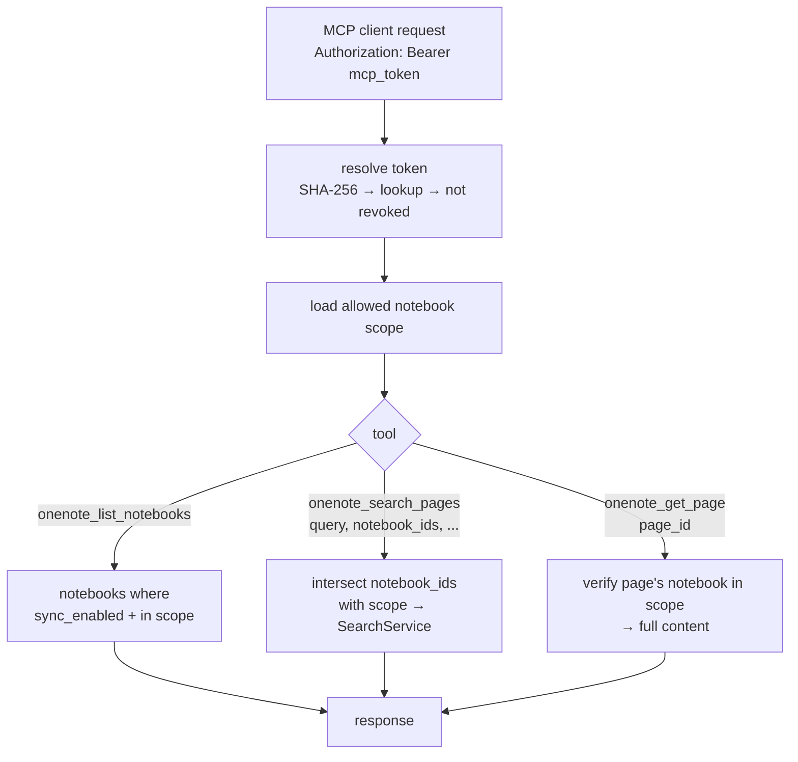
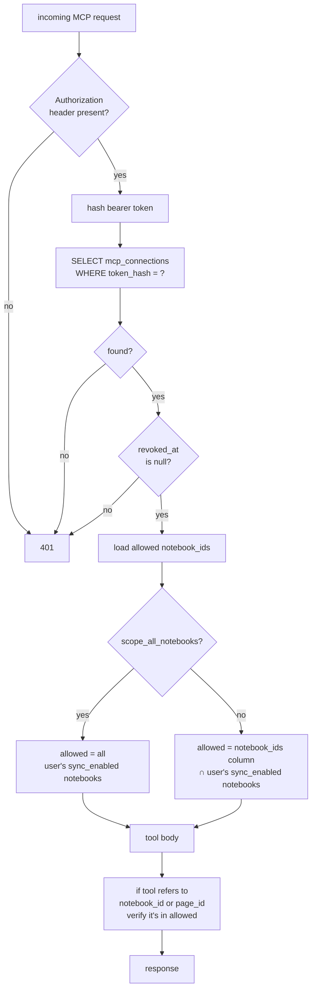

# MCP Server Plan

Stand up the FastMCP server mounted into the existing FastAPI ASGI app and implement the three read-only tools that MCP clients (Cursor, Claude Code, Codex) will call. Tools are namespaced under the `onenote_` prefix per Anthropic's guidance on disambiguating servers when a client has several MCP servers loaded.

---

## Why

This is the user-facing surface of the project. Everything we've built (sync, OCR, search) exists to feed these tools. The design balances:
- **Context efficiency** — `onenote_search_pages` returns short tagged snippets, not full pages; response models are stripped to the minimum the agent actually acts on
- **Caller control** — `notebook_ids` is required so callers narrow scope before searching
- **Progressive context** — callers can re-call `onenote_search_pages` with a larger `search_size` (up to 250) for more context around hits, or call `onenote_get_page` for the full combined content when a snippet isn't enough
- **Self-describing hits** — each hit carries `page_title`, `section_name`, `notebook_name` (not just IDs) so the agent reasons about results in natural language rather than alphanumeric handles, which Anthropic's tool-design guidance shows reduces hallucination

V1 deliberately omits:
- `get_page_image` — a raw-PNG escape hatch. OCR + larger snippets + full-page reads cover the realistic call patterns; serving page PNGs through MCP is context-heavy. Revisit if the OCR path proves insufficient.
- `list_sections` — a pure list-all tool with no downstream consumer (we have no `search_pages(section_id=…)`). Anthropic explicitly recommends search-focused tools over list-all. Add back when a section-scoped action exists.

---

## Tool Surface



All tools share three concerns:
1. **Token auth** — resolve the bearer token; fail 401 if revoked or unknown
2. **Notebook scope enforcement** — every page/notebook ID a caller references must intersect the connection's allowed scope
3. **Staleness signaling** — every `SearchHit` / `PageContent` carries a `stale: bool`. No separate human-readable note — the LLM can construct one from `notebook_name + stale` if it needs to surface it to the user.

---

## Tool Specs

### `onenote_list_notebooks()`

```python
class NotebookSummary(BaseModel):
    id: int
    display_name: str

@mcp.tool
async def onenote_list_notebooks() -> list[NotebookSummary]: ...
```

Intended as the **first call** by a new MCP session, so the caller can pick notebook IDs to scope `onenote_search_pages`. Filter is `sync_enabled = true` AND in the connection's scope.

**Tool description string** (this is the prompt context the LLM sees — write it as instructions to the agent):

> Lists the OneNote notebooks this MCP connection can see. Returns each notebook's `id` and `display_name`. Call this first in a new session so you have the notebook IDs needed to scope `onenote_search_pages`. Only notebooks the user has enabled for sync are returned — others won't appear here at all, so an empty response means there's nothing searchable.

### `onenote_search_pages(...)`

Wraps `SearchService.search`. Required `notebook_ids` — callers narrow scope before searching.

```python
@mcp.tool
async def onenote_search_pages(
    query: str,
    notebook_ids: list[int],
    search_size: int = 80,          # max 250
    max_pages: int = 10,            # max 20
    max_snippets_per_page: int = 5, # max 10
) -> list[SearchHit]: ...
```

Returns `list[SearchHit]` directly — no wrapper. `SearchHit` is the existing service-layer schema (`app/schemas.py`):

```python
class SearchSnippet(BaseModel):
    text: str

class SearchHit(BaseModel):
    page_id: int                       # for onenote_get_page
    page_title: Optional[str] = None
    section_name: str
    notebook_name: str                 # notebook_id intentionally omitted — agent can map back via list_notebooks cache
    snippets: list[SearchSnippet]
    stale: bool
```

No projection layer between service and MCP — the UI doesn't search, so one model is correct for V1. If a UI search feature lands later, split the model then.

**Tool description string:**

> Searches OneNote pages whose content matches `query`, returning relevance-ranked hits with title, section, notebook, and content snippets. `notebook_ids` is required — get IDs from `onenote_list_notebooks` first.
>
> Page content mixes verbatim typed text with best-effort OCR of handwritten and image content. OCR portions may contain recognition errors (e.g. `painters` for `Pointers`); search uses fuzzy matching to tolerate them. Snippets are character windows around matches, not sentences — expect mid-sentence cuts.
>
> Prefer narrow, targeted queries over broad ones. If a snippet doesn't give you enough context, either re-call with a larger `search_size` (up to 250) or call `onenote_get_page(page_id)` for the full combined content.
>
> `stale: true` on a hit means the page or its notebook is mid-sync — content may be incomplete.
>
> Parameters:
> - `query` (str, required): the search text. Supports phrase quoting (`"exact phrase"`) and exclusion (`-term`).
> - `notebook_ids` (list[int], required): notebooks to search. Obtain from `onenote_list_notebooks`.
> - `search_size` (int, default 80, max 250): characters of context on each side of a match.
> - `max_pages` (int, default 10, max 20): cap on pages returned.
> - `max_snippets_per_page` (int, default 5, max 10): cap on snippets per page.

### `onenote_get_page(page_id: int)`

Returns the full combined `content` for a page (typed + OCR in visual order). Verify the page's notebook is in scope.

```python
class PageContent(BaseModel):
    page_title: Optional[str] = None
    section_name: str
    notebook_name: str                 # notebook_id intentionally omitted, same reason as SearchHit
    content: str
    stale: bool

@mcp.tool
async def onenote_get_page(page_id: int) -> PageContent: ...
```

`page_id` is omitted from the response — the caller just passed it in.

**Tool description string:**

> Fetches the full combined content of a single OneNote page — typed text and OCR text interleaved in visual reading order. Use this when a snippet from `onenote_search_pages` lacks enough context to answer.
>
> Same content warning as `onenote_search_pages`: OCR portions may contain recognition errors. Reading order is best-effort, not pixel-faithful.
>
> `stale: true` means the page or its notebook is mid-sync — content may be incomplete.
>
> Parameters:
> - `page_id` (int, required): obtained from a `SearchHit` returned by `onenote_search_pages`.

---

## File-by-File Changes

### `app/mcp/__init__.py` (new)

Empty marker for the package.

### `app/mcp/server.py` (new)

- Create `FastMCP` instance
- Wire DB session + the services the three tools need (`SearchService`, `MCPConnectionService`, `NotebookService`, `PageRepository`) via FastMCP dependency injection or a context object — no MSAL/Graph clients needed now that `get_page_image` is out of scope
- Export the FastMCP ASGI app for mounting

### `app/mcp/auth.py` (new)

Thin wrapper that reads the bearer token off the incoming FastMCP request and delegates to `MCPConnectionService.resolve_token`. The hashing, lookup, revoked-check, and scope intersection all live in the service so the same code is reachable from the future REST routers when we build them.

### `app/mcp/tools.py` (new)

Three tool implementations as above (`onenote_list_notebooks`, `onenote_search_pages`, `onenote_get_page`). Each:
1. Calls `resolve_mcp_token` (via FastMCP's auth header injection)
2. Verifies notebook scope for any IDs the caller passed
3. Delegates to the relevant service (`SearchService`, `NotebookService`, `MCPConnectionService`)
4. Returns the service result directly — `SearchHit.stale` / `PageContent.stale` is the staleness signal; no extra wrapping

### `app/main.py`

Mount FastMCP at `/mcp`:

```python
from app.mcp.server import mcp_app

app = FastAPI(...)
app.mount("/mcp", mcp_app)
```

### `app/services/mcp_connection_service.py` (new)

Wraps the **existing** `MCPConnectionRepository` (`app/repositories/mcp_connection_repository.py` — already has `get_by_token_hash`, `list_by_user`, `create(user_id, MCPConnectionCreate) -> MCPConnectionResponse`, `update(connection_id, MCPConnectionUpdate)`). The service adds the bits the repo deliberately doesn't do: SHA-256 hashing on the way in, raw-token generation on creation, the "revoked" / "scope" resolution, and the `last_used_at` touch.

```python
class ResolvedMCPConnection(BaseModel):
    connection_id: int
    user_id: int
    allowed_notebook_ids: list[int]  # already intersected with sync_enabled notebooks; empty list = nothing visible

class MCPConnectionService:
    async def resolve_token(self, raw_token: str) -> ResolvedMCPConnection: ...
        # hash → repo.get_by_token_hash → assert revoked_at IS NULL → resolve scope → bump last_used_at (fire-and-forget)
    async def create(
        self,
        user_id: int,
        scope_all_notebooks: bool,
        notebook_ids: Optional[list[int]] = None,
        display_name: Optional[str] = None,
    ) -> tuple[MCPConnectionResponse, str]: ...
        # generates raw token, stores hash via repo.create, returns (response, raw_token_shown_once)
    async def list_for_user(self, user_id: int) -> list[MCPConnectionResponse]: ...
    async def revoke(self, user_id: int, connection_id: int) -> None: ...
        # repo.update with revoked_at=now()
```

All schema-level types here (`MCPConnectionResponse`, `MCPConnectionCreate`, `MCPConnectionUpdate`) are already defined in `app/schemas.py`.

### `app/services/notebook_service.py` (new)

Wraps the **existing** `NotebookRepository` (`list_by_user`, `get_by_id`, …). The service adds scope filtering against the resolved MCP connection and projects to the lean `NotebookSummary` shape the MCP tool exposes.

```python
class NotebookService:
    async def list_for_scope(self, scope: ResolvedMCPConnection) -> list[NotebookSummary]: ...
        # repo.list_by_user(scope.user_id) → filter by allowed_notebook_ids + sync_enabled=True → project to NotebookSummary
```

`SectionRepository` already exists but isn't called by the MCP layer in V1 (no `list_sections` tool). It stays in place for the future REST routers and the eventual section-scoped search.

---

## Auth & Scope Enforcement Detail



Every page/notebook ID the caller references is checked against `allowed` before any work happens. This prevents callers from poking at IDs outside their scope by guessing them.

---

## Staleness Signaling

Every hit / response carries a per-page `stale: bool`. A hit is stale if its page has `sync_status ∈ {syncing, failed}` or its notebook has `sync_status ∈ {syncing, failed}` — already implemented in `SearchService._is_stale`.

No separate human-readable string is emitted; the LLM can construct one from `notebook_name + stale` when surfacing to the user (e.g. *"Note: 'CS 246' is mid-sync, results may be incomplete."*). Shipping a pre-formatted note on every response is bloat the LLM doesn't need.

---

## Acceptance Criteria

- [ ] FastMCP mounted at `/mcp` on the FastAPI app
- [ ] MCP client (Claude Code or `mcp-cli`) can connect with a bearer token from `POST /api/mcp-connections`
- [ ] `onenote_list_notebooks` returns only notebooks in the connection's scope, regardless of how many notebooks the user owns
- [ ] `onenote_search_pages` with notebook IDs outside the connection's scope returns 0 hits for the out-of-scope IDs (or errors clearly)
- [ ] `onenote_search_pages` against the CS246 test page returns snippets including OCR'd words (proves end-to-end search service hookup)
- [ ] `onenote_get_page` returns full content including the typed text and OCR text interleaved
- [ ] Re-calling `onenote_search_pages` with a larger `search_size` returns longer snippets around the same hits (verifies the progressive-context pattern is usable in practice)
- [ ] Revoking a connection (set `revoked_at`) immediately causes 401 on subsequent tool calls
- [ ] `stale: true` appears on hits/responses whose page or notebook is mid-sync, `stale: false` otherwise

---

## Dependencies

- **Depends on** `search-service-plan.md` — `search_pages` requires `SearchService` and the `pg_trgm` index
- **Depends on** sync running at least once — there must be some `pages` with content to search
- **Independent of** `tiling-walkback-plan.md` — MCP server doesn't care how OCR text got there

---

## Out of Scope (for this plan)

- Web UI for creating/revoking MCP connections (separate frontend phase)
- The `routers/mcp_connections.py` REST endpoints (separate; uses the same service)
- `onenote_get_page_image` — a raw-PNG escape hatch that re-fetches from Graph and composites on demand. Deferred to V2; if the OCR + `onenote_get_page` path proves insufficient in real use, add it then.
- `onenote_list_sections(notebook_id)` — was in the original `docs/backend_plan.md` but cut from V1 because it's a list-all tool with no downstream consumer (we don't have section-scoped search). Add back together with `onenote_search_pages(section_ids=…)` or similar.
- `onenote_list_pages(section_id)` for browsing — V2 if it turns out callers want to enumerate without searching
- Rate limiting per MCP connection (V2)
