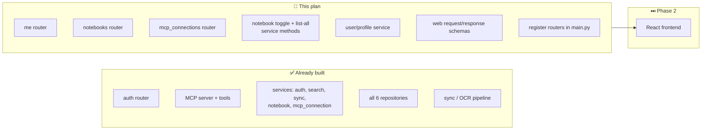
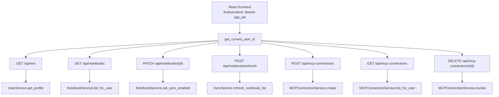
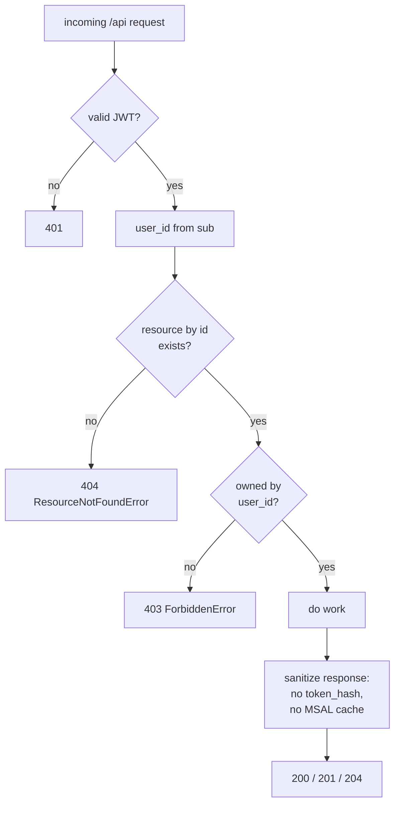
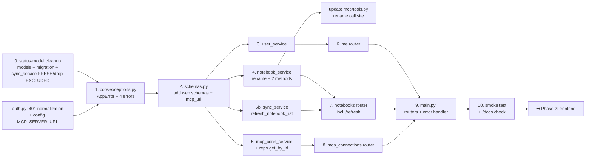

# REST API Layer Plan

Build the web-facing REST API the React frontend consumes. This is the **last backend slice before Phase 2 (frontend)**. The MCP server, sync/OCR pipeline, search, all repositories, and most services already exist — what's missing is the thin HTTP layer (`routers/me.py`, `routers/notebooks.py`, `routers/mcp_connections.py`) plus a small number of service methods and request/response schemas, and wiring it all into `main.py`.

---

## Why this, why now

`docs/plan.md` Phase 2 ("Local Frontend") lists three pages — **Notebooks**, **MCP connections**, **Account**. Each maps 1:1 onto a router that does not yet exist:

| Frontend page | Needs endpoint(s) | Router |
|---|---|---|
| Account | `GET /api/me`, `POST /auth/microsoft/disconnect` (exists) | `me.py` |
| Notebooks | `GET /api/notebooks`, `PATCH /api/notebooks/{id}`, `POST /api/notebooks/refresh` | `notebooks.py` |
| MCP connections | `POST` / `GET` / `DELETE /api/mcp-connections` | `mcp_connections.py` |

Today only `routers/auth.py` exists and is registered. Starting the frontend before these land means building UI against endpoints that 404. This plan closes that gap.

> **Why `POST /api/notebooks/refresh` exists (the first-run gap).** `GET /api/notebooks` reads the DB, but notebooks only land there when the sync job discovers them from Graph. So immediately after a user connects Microsoft — before any cron run — the Notebooks page would be **empty**, with no way to populate it from the UI. The refresh endpoint does a **names-only** Graph discovery (list notebooks → upsert → delete-stale; **no** sections, pages, or OCR) so the page can show notebooks the moment the account is linked, and the user can pick which to enable before the first heavy sync. *(Confirmed: this same discovery already runs at the top of every full sync — `sync_service._sync_connection` does get_notebooks → upsert_many → delete-stale, `sync_service.py:132-145` — so the button reuses existing logic rather than adding a parallel path.)*



---

## Design principles carried over from the codebase

The existing layers already encode these — the new code must not break them.

1. **Layered call chain** `routers → services → repositories / clients`. Routers do HTTP only (validate, call a service, shape the response). No business logic or raw SQL in routers. Services never call other services.
2. **Pydantic at every boundary.** SQLAlchemy models never leave the repository layer.
3. **Auth via `get_current_user_id`** (`app/core/auth.py`) — a FastAPI dependency that decodes the app JWT from `Authorization: Bearer` and returns the user id. Every `/api/*` endpoint here depends on it.

   **Normalize every auth failure to 401 (part of this slice).** Today `get_current_user_id` raises `401` for a bad/expired token, but the underlying `HTTPBearer()` (default `auto_error=True`) raises **`403`** when the `Authorization` header is *missing entirely* — a long-standing FastAPI quirk. That collides with the `ForbiddenError → 403` introduced below: the frontend could no longer tell "session gone, re-login" (must be 401) from "authenticated, but not your resource" (403). Switch the bearer to `auto_error=False` and own the missing-header case:

   ```python
   _security = HTTPBearer(auto_error=False)  # we raise 401 ourselves for the missing-header case

   def get_current_user_id(
       credentials: Annotated[HTTPAuthorizationCredentials | None, Depends(_security)],
   ) -> int:
       if credentials is None:
           raise HTTPException(status_code=401, detail="Not authenticated")
       try:
           payload = jwt.decode(credentials.credentials, settings.APP_SESSION_SECRET, algorithms=[_ALGORITHM])
           return int(payload["sub"])
       except (jwt.PyJWTError, KeyError, ValueError):
           raise HTTPException(status_code=401, detail="Invalid or expired token")
   ```

   After this, **401 always means "authenticate", 403 always means "authenticated but not allowed."** The frontend's axios interceptor keys re-login off 401 only. This is a small edit to an existing file, but it must land with this slice since it's what makes the 403 below unambiguous.
4. **Secrets never cross the wire to the frontend.** Two concrete leaks to prevent (both are real today):
   - `MicrosoftConnectionResponse.encrypted_msal_token_cache` — the encrypted MSAL cache. `docs/plan.md` is explicit: *"The frontend and MCP clients should never receive Microsoft access tokens, refresh tokens, or the MSAL token cache."*
   - `MCPConnectionResponse.token_hash` — the stored token hash. No reason for the browser to ever see it.

   Both existing response schemas are repository-internal. The REST layer needs **sanitized web-facing variants**.
5. **Authorization lives in the service, not the router.** Any method that takes both a `user_id` (from the JWT) and a resource ID (from the URL/body) owns the ownership check itself and signals failure by **raising a typed domain error** — never by returning `None`/`False` for the router to interpret. See the next section.

---

## Authorization (RBAC) at the service layer

### Domain error model — `app/core/exceptions.py`

`core/exceptions.py` today holds only `MSALAuthError` and `GraphAPIError` (neither carries HTTP meaning). Add a small base + three HTTP-mappable domain errors so services can express *intent* while staying HTTP-agnostic. **Each error owns its own status code** as a class attribute — the status lives with the error definition, not in a lookup table elsewhere:

```python
class AppError(Exception):
    """Base for domain errors mapped to HTTP status codes by a handler in main.py.
    Each subclass sets `status_code`; the handler reads it directly."""
    status_code = 500

class ResourceNotFoundError(AppError):
    """The resource genuinely does not exist."""
    status_code = 404

class ForbiddenError(AppError):
    """The resource exists but the authenticated caller isn't allowed to act on
    it (e.g. it belongs to another user). 403 — honest, not masked.
    See "404 vs 403" below for the threat-model rationale."""
    status_code = 403

class InvalidRequestError(AppError):
    """Semantically invalid request the schema can't catch (e.g. notebook_ids
    in a create body referencing notebooks the caller doesn't own)."""
    status_code = 400

class ConflictError(AppError):
    """The request is well-formed but the account isn't in a state that allows
    it — e.g. POST /api/notebooks/refresh when there's no active Microsoft
    connection, or the token needs re-auth."""
    status_code = 409
```

A single handler in `main.py` reads `exc.status_code`, so routers contain **no** ownership branches or `try/except` for authz, and `main.py` carries **no** status mapping:

```python
from fastapi.responses import JSONResponse
from app.core.exceptions import AppError

@app.exception_handler(AppError)
async def _app_error_handler(request, exc: AppError):
    return JSONResponse(status_code=exc.status_code, content={"detail": str(exc) or exc.__class__.__name__})
```

> **Idiom note — this is the *only* error pattern for `/api/*` business and authz failures.** The existing `routers/auth.py` raises `HTTPException` **inline** (400s for the Microsoft `error` param, missing/invalid state cookie). That's deliberate and stays as-is: those are *transport/protocol* concerns at the OAuth-callback boundary (cookies, redirects, the provider's own error) with no service decision behind them — not domain logic. The rule is precise: **no business or authorization outcome is expressed via `HTTPException` in a router; it's a typed `AppError` raised in the service and mapped centrally.** Don't "harmonize" `auth.py` into AppError — there's no domain error there to model.
>
> Two distinct "bad input" codes will coexist, and that's expected: FastAPI returns **422** for request-schema violations (wrong type, missing required field — caught by Pydantic before the handler runs), while **400** (`InvalidRequestError`) is for semantic validation the schema can't express. The frontend's create form must treat both as user-fixable input errors.

### 404 vs 403 — the honest model

We use status codes literally:

- **404** — the resource does not exist.
- **403** — it exists, but the authenticated caller isn't authorized (typically: it's another user's).

Both are sanctioned by RFC 9110. Practice is genuinely split, and the deciding factor is *whether existence is sensitive*, not a blanket convention:
- **In-tenant permission denials** (you can already see the resource exists; you lack a role) → **403**, universally.
- **Cross-tenant access** (resource belongs to another account) → mature multi-tenant APIs often **mask with 404** (Stripe returns 404 for another account's object; GitHub for private repos) specifically to block cross-account enumeration. RFC 9110 §15.5.4 explicitly permits this: a server "that wishes to 'hide' the current existence of a forbidden target resource MAY instead respond with a status code of 404."

**Decision for this project: be honest (403 for exists-but-not-authorized) everywhere — web *and* MCP.** We accept the masking tradeoff knowingly. With global sequential integer PKs (`pages.id`, `notebooks.id`, `mcp_connections.id`), the only thing masking would actually buy is hiding **platform-wide volume/growth** (enumerate IDs, binary-search the max live one). Knowing an ID is real grants nothing else — every action stays authz-gated, and we never reveal the resource's owner, name, or content. For a personal note-taking tool that volume signal is low-value, and it's not worth the semantic dishonesty: 403-vs-404 makes client UX and debugging far clearer. (If volume disclosure ever matters, the right fix is non-sequential IDs — UUID/ULID — not status-code masking, which is a weak patch over guessable IDs.)

Implementing it means the service distinguishes "missing" from "exists-but-not-mine" by fetching the row and branching:

```python
nb = await self._notebook_repo.get_by_id(notebook_id)
if nb is None:
    raise ResourceNotFoundError("Notebook not found")   # → 404
if nb.user_id != user_id:
    raise ForbiddenError("Not your notebook")           # → 403
```

**Body-referenced IDs are different.** `notebook_ids` in the create-connection body isn't *addressing* a resource — it's validating a list of inputs. A foreign or nonexistent id there is just "not a valid choice for you" → a single **400** `InvalidRequestError("one or more notebook_ids are invalid")`, which also avoids per-id existence probing through the create endpoint. The 403/404 split applies to direct addressing (`/resource/{id}`), not body validation.

> **The MCP layer follows the same honest model — with one refinement: never reveal ownership.** Today `onenote_get_page` masks (`raise ToolError("Page … not found")` for both missing and out-of-scope). Change it to distinguish two cases only:
> - page doesn't exist → "Page … not found"
> - page exists but its notebook isn't in *this token's* scope → "Page … is outside this connection's scope"
>
> Crucially, the out-of-scope error does **not** say whose page it is — so we don't leak cross-tenant ownership, only that the integer is a real page. This also delivers the main DX win: the common legitimate case is the user's *own* page in a notebook this connection wasn't scoped to, and "out of scope" tells the agent to use/widen a connection instead of a misleading "not found." (MCP tools raise `ToolError`, which has no HTTP code — "honest" here means two distinct messages, not two status codes.)

### RBAC inventory — every user-supplied ID that reaches a resource

| Service method | Untrusted input | Check | Failure → |
|---|---|---|---|
| `NotebookService.set_sync_enabled(user_id, notebook_id, enabled)` | `notebook_id` (URL) | row exists? owned? | missing → `ResourceNotFoundError` (404); not owned → `ForbiddenError` (403) |
| `MCPConnectionService.revoke(user_id, connection_id)` | `connection_id` (URL) | row exists? owned? | missing → `ResourceNotFoundError` (404); not owned → `ForbiddenError` (403) |
| `MCPConnectionService.create(user_id, notebook_ids, …)` | `notebook_ids` (body) | every id ∈ user's notebooks | `InvalidRequestError` → 400 *(non-leaking: doesn't say which id)* |
| `NotebookService.list_for_user(user_id)` | — (JWT-scoped) | — | safe |
| `SyncService.refresh_notebook_list(user_id)` | — (JWT-scoped) | MS connection active? | no active connection / reauth → `ConflictError` (409) |
| `MCPConnectionService.list_for_user(user_id)` | — (JWT-scoped) | — | safe |
| `UserService.get_profile(user_id)` | — (JWT-scoped) | — | safe |
| `AuthService.disconnect(user_id)` *(exists)* | — (JWT-scoped) | — | safe |

The MCP tools enforce a **different** RBAC axis — the MCP token's resolved notebook scope (`current_scope()`), not the user JWT — so they're outside this table, but follow the same honest model: `onenote_get_page` distinguishes "not found" from "out of this connection's scope" (without revealing ownership — see the note above).

---

## Endpoint reference



| Method | Path | Auth | Request body | Response | Service call |
|---|---|---|---|---|---|
| GET | `/api/me` | JWT | — | `MeResponse` | `UserService.get_profile` |
| GET | `/api/notebooks` | JWT | — | `list[NotebookWebResponse]` | `NotebookService.list_for_user` |
| PATCH | `/api/notebooks/{id}` | JWT | `NotebookSyncToggleRequest` | `204` | `NotebookService.set_sync_enabled` |
| POST | `/api/notebooks/refresh` | JWT | — | `list[NotebookWebResponse]` | `SyncService.refresh_notebook_list` → re-list |
| POST | `/api/mcp-connections` | JWT | `MCPConnectionCreateRequest` | `MCPConnectionCreatedResponse` *(exists)* | `MCPConnectionService.create` |
| GET | `/api/mcp-connections` | JWT | — | `list[MCPConnectionWebResponse]` | `MCPConnectionService.list_for_user` |
| DELETE | `/api/mcp-connections/{id}` | JWT | — | `204` | `MCPConnectionService.revoke` |

---

## Schema changes — `app/schemas.py`

Three new web response schemas (sanitized) and two new request schemas. `MCPConnectionCreatedResponse` already exists and gets **one new field** (`mcp_url`, see below) so the connections page can show the user a complete, copy-pasteable client config at creation time.

### `MCPConnectionCreatedResponse` — add `mcp_url`

The raw token alone is useless without the server URL the client points at (`http://localhost:8000/mcp` locally). Return it alongside the token so the "show once" panel has everything:

```python
class MCPConnectionCreatedResponse(BaseModel):
    id: int
    display_name: Optional[str] = None
    scope_all_notebooks: bool
    notebook_ids: Optional[list[int]] = None
    created_at: datetime
    raw_token: str
    mcp_url: str   # NEW — the MCP endpoint the client connects to, e.g. http://localhost:8000/mcp
```

The value is a **single source of truth in config**, not scattered string literals. It differs between local and prod, so make it a settings field with a localhost default (same pattern as the existing `FRONTEND_ORIGIN`), and have `MCPConnectionService.create` read it:

```python
# core/config.py  (Pydantic settings)
MCP_SERVER_URL: str = "http://localhost:8000/mcp"   # override per-env in Railway

# in MCPConnectionService.create(...), populate the response:
mcp_url=settings.MCP_SERVER_URL,
```

> Only the **creation** response carries `mcp_url` (it pairs with the once-shown `raw_token`). It's a constant across all of a user's connections, so the list/`GET` shape doesn't repeat it per row — the connections *page* can also display the same `settings.MCP_SERVER_URL` standalone for already-created connections.

### New response schemas

```python
class MeResponse(BaseModel):
    """Account page payload. Combines the user profile with the Microsoft
    connection *status only* — never the encrypted MSAL cache.

    A single nullable status carries all three frontend states, so no separate
    `connected` bool is needed:
      - None          → never linked a Microsoft account → "Connect"
      - ACTIVE        → connected, healthy               → "Connected"
      - NEEDS_REAUTH  → connected, refresh token died    → "Reconnect"
    """
    id: int
    email: str
    display_name: str
    created_at: datetime
    microsoft_status: Optional[MicrosoftConnectionStatus] = None  # None = not connected


class NotebookWebResponse(BaseModel):
    """Notebook as shown on the web Notebooks page. Includes sync state so the
    UI can render status + the enable/disable toggle. `onenote_id` and
    `user_id` are dropped — the browser has no use for either.

    `sync_status` is non-nullable under the cleaned-up status model (see
    "Sync-status model" below): always one of PENDING / SYNCING / FRESH /
    FAILED. It is orthogonal to `sync_enabled` — a disabled notebook still
    carries whatever status it last had; the UI renders "Disabled" off
    `sync_enabled`, not off a status value."""
    id: int
    display_name: str
    sync_enabled: bool
    sync_status: NotebookSyncStatus
    last_synced_at: Optional[datetime] = None  # null only while PENDING (never synced)


class MCPConnectionWebResponse(BaseModel):
    """MCP connection as listed on the web. `token_hash`, `user_id`, and
    `raw_token` are all absent — the raw token is shown exactly once at creation
    time via MCPConnectionCreatedResponse, never again.

    The drop is enforced by FastAPI's `response_model`, not a hand-written
    projection: the GET router returns the repo-internal `MCPConnectionResponse`
    rows directly and declares `-> list[MCPConnectionWebResponse]`, so FastAPI
    serializes against *this* schema and any field not declared here (the
    `token_hash`/`user_id`) is dropped. `from_attributes=True` lets it read
    straight off the internal objects."""
    model_config = ConfigDict(from_attributes=True)

    id: int
    display_name: Optional[str] = None
    scope_all_notebooks: bool
    notebook_ids: Optional[list[int]] = None
    created_at: datetime
    last_used_at: Optional[datetime] = None
    revoked_at: Optional[datetime] = None
```

> **Why `response_model` rather than an explicit `from_internal` classmethod.**
> The route's `response_model` *is* the security boundary: every field the
> browser can see must be explicitly declared on `MCPConnectionWebResponse`, so
> a future sensitive field added to the internal `MCPConnectionResponse` is
> dropped **by default** — no one has to remember to leave it out of a
> projection. Declare it as the **decorator kwarg**, not the return annotation:
> `@router.get("", response_model=list[MCPConnectionWebResponse])` with the
> handler annotated `-> list[MCPConnectionResponse]` (what the service actually
> returns). Annotating the *return type* as the web shape while returning
> internal rows trips static type checkers (invariant `list[...]`), so keep the
> two separate: `response_model` for FastAPI's serialization/leak guard, the
> return annotation for the truth. Two invariants keep this safe: (1) never put
> `extra="allow"` on the web schema, and (2) keep `response_model` set to the
> concrete `list[MCPConnectionWebResponse]`. Under those, this is the cleaner,
> more leak-resistant pattern.

### Sync-status model — clean it up before the frontend reads it

> **Prerequisite for the Notebooks page.** The current status enums are a mess the frontend would inherit, so fix them now (greenfield — no production data, just a fresh migration). The authoritative definition lives in **`docs/db_plan.md`**; the change touches `app/models.py`, the migration, and `app/services/sync_service.py`. Summary of the target model:
>
> - **Single explicit, non-nullable enum** for both `notebooks.sync_status` and `pages.sync_status`: `PENDING` (discovered, never synced) · `SYNCING` (in progress) · `FRESH` (synced OK) · `FAILED` (last attempt errored). New rows default to `PENDING`.
> - **No `STALE` to drop** — there has never been a stored `STALE` value. Both enums today are `SYNCING/FAILED(/EXCLUDED)` (verified: initial migration `c51d7c14c289`, lines 63 & 86); staleness is *derived* at read time (`_is_stale` flags `SYNCING`/`FAILED`, surfaced as the `stale: bool` response field). It stays derived — this cleanup doesn't touch it.
> - **Drop `EXCLUDED`** — it's redundant with `sync_enabled=false` and creates a second source of truth. `sync_service._sync_connection` currently sets `EXCLUDED` on disabled notebooks (`sync_service.py:147-153`); delete that block. Exclusion is `sync_enabled`, status is sync health — orthogonal.
> - **Kill the `None`-means-fresh overloading.** Today success is written as `sync_status=None` (`sync_service.py:99, 172, 313`), so `None` ambiguously meant both "never synced" and "synced fine." Under the new model those writes become `sync_status=FRESH`, and "never synced" is the explicit `PENDING`.
>
> **Frontend render contract** (what the Notebooks page switches on):
>
> | `sync_enabled` | `sync_status` | UI |
> |---|---|---|
> | `false` | *(any)* | "Disabled" — toggle off; ignore status |
> | `true` | `PENDING` | "Not synced yet" (will sync on next run / Refresh) |
> | `true` | `SYNCING` | "Syncing…" spinner |
> | `true` | `FRESH` | "Synced · {last_synced_at}" |
> | `true` | `FAILED` | "Sync failed" — error badge |
>
> This keeps `MeResponse.microsoft_status` (legitimately nullable — `None` = no connection row) as the *only* nullable status in the API; notebook/page status is always a concrete value.

### New request schemas

```python
class NotebookSyncToggleRequest(BaseModel):
    """PATCH /api/notebooks/{id} body. Intentionally a single field — the client
    may only flip `sync_enabled`. `sync_status` / `last_synced_at` are owned by
    the sync job and must not be settable from the browser (which is why we do
    NOT reuse the internal `NotebookUpdate` schema here)."""
    sync_enabled: bool


class MCPConnectionCreateRequest(BaseModel):
    """POST /api/mcp-connections body."""
    display_name: Optional[str] = None
    scope_all_notebooks: bool
    notebook_ids: Optional[list[int]] = None

    # Validation enforced in the service (not just here):
    #  - scope_all_notebooks=False  → notebook_ids required, non-empty
    #  - scope_all_notebooks=True   → notebook_ids ignored / forced to None
    #  - every id in notebook_ids must belong to the calling user
```

> **Why separate request schemas instead of reusing `NotebookUpdate` / `MCPConnectionCreate`?** The internal create/update schemas expose fields the client must not control (`token_hash`, `sync_status`, `last_synced_at`, `revoked_at`). Mass-assignment from a request body into those is the classic over-posting bug. Keep client-facing request shapes minimal and explicit.

---

## Service changes

### `services/user_service.py` — **new**

There is no service today that assembles "who am I". Thin wrapper over the two existing repos.

```python
class UserService:
    def __init__(self, session: AsyncSession) -> None:
        self._users = UserRepository(session)
        self._ms = MicrosoftConnectionRepository(session)

    async def get_profile(self, user_id: int) -> MeResponse:
        user = await self._users.get_by_id(user_id)           # UserResponse | None
        if user is None:
            raise ResourceNotFoundError("User not found")     # → 404 via handler
        conn = await self._ms.get_by_user_id(user_id)         # MicrosoftConnectionResponse | None
        return MeResponse(
            id=user.id,
            email=user.email,
            display_name=user.display_name,
            created_at=user.created_at,
            microsoft_status=conn.status if conn else None,   # read .status ONLY —
        )                                                     # never the encrypted cache
```

Both repo methods already exist (`UserRepository.get_by_id`, `MicrosoftConnectionRepository.get_by_user_id`). The `None` guard shouldn't trigger for a valid JWT, but it raises `ResourceNotFoundError` rather than returning `None`, so the router needs no not-found branch.

### `services/notebook_service.py` — **rename + extend**

> **Renaming (do this first).** The current method named `list_for_user` actually returns *only sync-enabled* notebooks in the slim `NotebookSummary` shape — it's the MCP-scoped lister. That's a misleading name: the unqualified `list_for_user` should mean "everything for this user." Rename the existing method to **`list_enabled_summaries`** and give the new web "all notebooks" method the now-freed **`list_for_user`** name.
>
> Current callers of the old name (both must be updated to `list_enabled_summaries(user_id=…, filter_notebook_ids=…)`):
> - `app/mcp/tools.py:54` (`onenote_list_notebooks`) — the production path.
> - `backend/scripts/smoke_mcp.py:152` and `:161` — the MCP smoke test asserts on it; miss these and the smoke run breaks.
>
> **Name-collision caution.** `MCPConnectionService.list_for_user` (`mcp_connection_service.py:101`) is a **different** method on a **different** service — it's the connections web-lister and is already correctly named, so it stays. After this change both services expose a `list_for_user` meaning "everything for this web user" (notebooks / connections respectively), which is consistent; only `NotebookService`'s MCP-scoped method is the misnamed one being renamed. Don't rename or touch the `MCPConnectionService` one — just be sure the rename lands on the notebook service and nothing else.

```python
# RENAMED from the old list_for_user — same body, clearer name. MCP-scoped:
# sync-enabled only, slim NotebookSummary shape, optional id filter.
async def list_enabled_summaries(
    self, user_id: int, filter_notebook_ids: list[int] | None = None
) -> list[NotebookSummary]:
    ...  # unchanged logic

# NEW — backs GET /api/notebooks. Every notebook the user owns (enabled AND
# disabled) with full sync state, so the web UI can render the toggle + status.
async def list_for_user(self, user_id: int) -> list[NotebookWebResponse]:
    notebooks = await self._notebook_repo.list_by_user(user_id)
    return [NotebookWebResponse(...) for nb in notebooks]   # no sync_enabled filter

# NEW — backs PATCH /api/notebooks/{id}. Returns None → router answers 204.
async def set_sync_enabled(self, user_id: int, notebook_id: int, enabled: bool) -> None:
    """Flip sync_enabled. notebook_id comes straight from the URL and must not
    be trusted: 404 if it doesn't exist, 403 if it exists but isn't owned by
    user_id (honest model — see Authorization section).

    Returns nothing on purpose: a deterministic single-field flip with no
    server-derived side effects means the caller already knows the resulting
    state, so there's no representation worth returning (204, not a fabricated
    body). If toggling ever gains side effects, switch to a real refetch and
    return the authoritative resource."""
    nb = await self._notebook_repo.get_by_id(notebook_id)
    if nb is None:
        raise ResourceNotFoundError("Notebook not found")
    if nb.user_id != user_id:
        raise ForbiddenError("Not your notebook")
    await self._notebook_repo.update(notebook_id, NotebookUpdate(sync_enabled=enabled))
```

`NotebookRepository.update(notebook_id, NotebookUpdate)` and `get_by_id` already exist.

> **Interaction with MCP scope (free, no code):** `MCPConnectionService.resolve_token` already intersects every connection's scope with the set of *currently sync-enabled* notebooks. So disabling a notebook here automatically removes it from every MCP connection's visible scope on the next request — satisfying `docs/plan.md`'s "excluded notebooks must not appear in the MCP." No extra work; just verify it in testing.

### `services/mcp_connection_service.py` — **extend slightly**

`create`, `list_for_user`, and `revoke` all already exist. Two adjustments:

1. **`create` — validate `notebook_ids` ownership + scope shape.** Today `create` trusts its arguments. The router passes user-supplied `notebook_ids`; the service must reject ids the user doesn't own (otherwise a user could mint a connection scoped to someone else's notebook id and, combined with a future bug, read it). Raise `InvalidRequestError` (→ 400):

   ```python
   if not scope_all_notebooks:
       if not notebook_ids:
           raise InvalidRequestError("notebook_ids required when scope_all_notebooks is False")
       owned = {nb.id for nb in await self._notebook_repo.list_by_user(user_id)}
       if not set(notebook_ids).issubset(owned):
           # 400, not 404 — it's a create, and the message deliberately doesn't
           # reveal which id is unowned (non-leaking).
           raise InvalidRequestError("one or more notebook_ids are invalid")
   ```

2. **`revoke` — raise (404/403 split) instead of silently no-op'ing.** Today it returns `None` whether or not the connection was owned, and its docstring punts the decision to the router (*"the REST layer should 404 in that case"*). That puts the authorization decision in the wrong layer, and `list_by_user` membership can't distinguish "missing" from "someone else's." Add `MCPConnectionRepository.get_by_id(connection_id) -> MCPConnectionResponse | None` (the repo doesn't have it yet — it has `get_by_token_hash`, `list_by_user`, `create`, `update`) and branch:

   ```python
   async def revoke(self, user_id: int, connection_id: int) -> None:
       """Revoke a connection. 404 if it doesn't exist, 403 if it exists but
       isn't owned by user_id (honest model — see Authorization section)."""
       conn = await self._repo.get_by_id(connection_id)
       if conn is None:
           raise ResourceNotFoundError("Connection not found")
       if conn.user_id != user_id:
           raise ForbiddenError("Not your connection")
       await self._repo.update(connection_id, MCPConnectionUpdate(revoked_at=now))
   ```
   The MCP server does not call `revoke`, so changing its failure behavior is safe. **Update the existing docstring** — drop the "the REST layer should 404" sentence; the service now decides.

`list_for_user` returns `list[MCPConnectionResponse]` (includes `token_hash`). The **router** drops the hash by declaring `-> list[MCPConnectionWebResponse]`: FastAPI's `response_model` serializes against that schema, so undeclared fields (`token_hash`/`user_id`) never reach the wire. The service stays reusable (it still returns the full internal shape).

### `services/sync_service.py` — **add `refresh_notebook_list` + dedupe discovery**

Backs `POST /api/notebooks/refresh`. `SyncService` already owns `graph_client` + `msal_client`, so notebook discovery belongs here — **not** in `NotebookService` (which is deliberately session-only and scope-blind, and is built as `NotebookService(session)` in `mcp/tools.py`; adding Graph/MSAL deps would break that). Extract the discovery block that `_sync_connection` already runs inline (`sync_service.py:132-145`) into a shared helper and reuse it both places:

```python
async def refresh_notebook_list(self, user_id: int) -> None:
    """Names-only Graph discovery for one user: list notebooks → upsert → delete-stale.
    No sections, pages, or OCR. Web-facing, so it raises typed AppErrors."""
    connection = await self._connection_repo.get_by_user_id(user_id)
    if connection is None or connection.status != MicrosoftConnectionStatus.ACTIVE:
        raise ConflictError("No active Microsoft connection — connect your account first")  # → 409
    access_token = await self._acquire_token(connection)
    if access_token is None:
        # _acquire_token already flipped the connection to NEEDS_REAUTH
        raise ConflictError("Microsoft session expired — reconnect your account")            # → 409
    await self._discover_notebooks(connection.user_id, access_token)

async def _discover_notebooks(self, user_id: int, access_token: str) -> list[NotebookResponse]:
    """The get_notebooks → upsert_many → delete-stale step, lifted verbatim out of
    _sync_connection so the cron and the refresh button share one implementation."""
    ...  # exactly sync_service.py:132-145, returning the upserted db_notebooks

# _sync_connection then calls: db_notebooks = await self._discover_notebooks(connection.user_id, access_token)
```

Notes:
- `MicrosoftConnectionStatus`, `ConflictError`, and `NotebookResponse` are already imported (or trivially added) in `sync_service.py`.
- The cron's full `run()` is untouched in behavior — `_sync_connection` just calls the extracted helper instead of inlining it.
- The endpoint returns the **full web list** by having the router re-call `NotebookService.list_for_user(user_id)` after the refresh, so the response shape is identical to `GET /api/notebooks` (and reuses the existing projection rather than teaching `SyncService` about web schemas).

---

## Router files

All three follow the **exact `routers/auth.py` pattern**: module-level `APIRouter(prefix=..., tags=...)`, a `get_*_service` dependency factory (mirroring `get_auth_service`), and `get_current_user_id` for auth. Note there are **no `try/except` blocks and no not-found branches** in the routers — the service raises typed `AppError`s and the central handler in `main.py` maps them to status codes. Routers are pure HTTP shaping.

Each router defines its service factory exactly like `auth.py` does, e.g.:

```python
def get_notebook_service(
    session: Annotated[AsyncSession, Depends(get_session)],
) -> NotebookService:
    return NotebookService(session)

# Reused alias to keep handler signatures readable:
UserId = Annotated[int, Depends(get_current_user_id)]
NotebookServiceDep = Annotated[NotebookService, Depends(get_notebook_service)]
```

### `routers/me.py` — new

```python
router = APIRouter(prefix="/api", tags=["me"])

def get_user_service(session: Annotated[AsyncSession, Depends(get_session)]) -> UserService:
    return UserService(session)

@router.get("/me")
async def get_me(
    user_id: Annotated[int, Depends(get_current_user_id)],
    service: Annotated[UserService, Depends(get_user_service)],
) -> MeResponse:
    return await service.get_profile(user_id)   # raises ResourceNotFoundError → 404
```

### `routers/notebooks.py` — new

```python
router = APIRouter(prefix="/api/notebooks", tags=["notebooks"])

def get_notebook_service(session: Annotated[AsyncSession, Depends(get_session)]) -> NotebookService:
    return NotebookService(session)

def get_sync_service(
    request: Request,
    session: Annotated[AsyncSession, Depends(get_session)],
    msal_client: Annotated[MSALClient, Depends(get_msal_client)],
) -> SyncService:
    # graph_client is built once in main.py's lifespan and stashed on app.state.
    # A names-only refresh needs no ocr_client.
    return SyncService(session, request.app.state.graph_client, msal_client)

@router.get("")
async def list_notebooks(
    user_id: Annotated[int, Depends(get_current_user_id)],
    service: Annotated[NotebookService, Depends(get_notebook_service)],
) -> list[NotebookWebResponse]:
    return await service.list_for_user(user_id)

@router.patch("/{notebook_id}", status_code=204)
async def toggle_notebook(
    notebook_id: int,
    body: NotebookSyncToggleRequest,
    user_id: Annotated[int, Depends(get_current_user_id)],
    service: Annotated[NotebookService, Depends(get_notebook_service)],
) -> None:
    await service.set_sync_enabled(user_id, notebook_id, body.sync_enabled)
    # 204 No Content — deterministic single-field flip, nothing to return.
    # missing → 404, not owned → 403 (raised by service, mapped by handler)

@router.post("/refresh")
async def refresh_notebooks(
    user_id: Annotated[int, Depends(get_current_user_id)],
    sync_service: Annotated[SyncService, Depends(get_sync_service)],
    service: Annotated[NotebookService, Depends(get_notebook_service)],
) -> list[NotebookWebResponse]:
    await sync_service.refresh_notebook_list(user_id)  # Graph names-only; ConflictError → 409
    return await service.list_for_user(user_id)         # same shape as GET /api/notebooks
```

> `POST /api/notebooks/refresh` takes **no path/body params**, so it has no resource-ownership check — it's JWT-scoped to the caller (like the list endpoints). The frontend should gate the button on `MeResponse.microsoft_status` (hide/disable when `None` or `NEEDS_REAUTH`); the `409 ConflictError` is the backend's honest fallback if the connection died between page load and click.

### `routers/mcp_connections.py` — new

```python
router = APIRouter(prefix="/api/mcp-connections", tags=["mcp-connections"])

def get_mcp_connection_service(
    session: Annotated[AsyncSession, Depends(get_session)],
) -> MCPConnectionService:
    return MCPConnectionService(session)

@router.post("", status_code=201)
async def create_connection(
    body: MCPConnectionCreateRequest,
    user_id: Annotated[int, Depends(get_current_user_id)],
    service: Annotated[MCPConnectionService, Depends(get_mcp_connection_service)],
) -> MCPConnectionCreatedResponse:
    return await service.create(                 # InvalidRequestError → 400 (handler)
        user_id=user_id,
        scope_all_notebooks=body.scope_all_notebooks,
        notebook_ids=body.notebook_ids,
        display_name=body.display_name,
    )

@router.get("")
async def list_connections(
    user_id: Annotated[int, Depends(get_current_user_id)],
    service: Annotated[MCPConnectionService, Depends(get_mcp_connection_service)],
) -> list[MCPConnectionWebResponse]:
    # response_model (the return annotation) projects each internal row to the
    # web shape, dropping token_hash/user_id. The annotation IS the leak guard.
    return await service.list_for_user(user_id)

@router.delete("/{connection_id}", status_code=204)
async def revoke_connection(
    connection_id: int,
    user_id: Annotated[int, Depends(get_current_user_id)],
    service: Annotated[MCPConnectionService, Depends(get_mcp_connection_service)],
) -> None:
    await service.revoke(user_id, connection_id)  # missing → 404, not owned → 403
```

### `app/main.py` — register routers + the AppError handler

```python
from fastapi.responses import JSONResponse
from app.routers import auth, me, notebooks, mcp_connections
from app.core.exceptions import AppError
...
app.include_router(auth.router)
app.include_router(me.router)
app.include_router(notebooks.router)
app.include_router(mcp_connections.router)
app.mount("/mcp", mcp_app)

# Maps domain errors → HTTP by reading each error's own status_code.
# Keeps routers (and main.py) free of any status mapping.
@app.exception_handler(AppError)
async def _app_error_handler(request, exc: AppError):
    return JSONResponse(status_code=exc.status_code, content={"detail": str(exc) or exc.__class__.__name__})
```

---

## File-by-file summary

| File | Action | Notes |
|---|---|---|
| `app/core/auth.py` | edit | `HTTPBearer(auto_error=False)` + raise **401** for the missing-header case, so 403 stays reserved for `ForbiddenError` |
| `app/core/exceptions.py` | edit | + `AppError` + 4 subclasses, each carrying its own `status_code`: `ResourceNotFoundError` (404), `ForbiddenError` (403), `InvalidRequestError` (400), `ConflictError` (409) |
| `app/core/config.py` | edit | + `MCP_SERVER_URL` setting (default `http://localhost:8000/mcp`; override per-env) |
| `app/models.py` + migration | edit | **status-model cleanup**: `notebooks.sync_status` & `pages.sync_status` → non-nullable enum `PENDING/SYNCING/FRESH/FAILED`, default `PENDING`; add `PENDING`/`FRESH`, drop `EXCLUDED` (there is no stored `STALE` to drop — it's derived) (see `docs/db_plan.md`) |
| `app/schemas.py` | edit | + `MeResponse`, `NotebookWebResponse` (non-nullable `sync_status`), `MCPConnectionWebResponse` (+ `from_internal`), `NotebookSyncToggleRequest`, `MCPConnectionCreateRequest`; + `mcp_url` on `MCPConnectionCreatedResponse` |
| `app/services/user_service.py` | **new** | `get_profile(user_id) -> MeResponse` (raises `ResourceNotFoundError`) |
| `app/services/notebook_service.py` | edit | **rename** old `list_for_user` → `list_enabled_summaries`; **add** new `list_for_user` (all, web shape) + `set_sync_enabled` (404/403) |
| `app/services/sync_service.py` | edit | **add** `refresh_notebook_list(user_id)` (names-only, raises `ConflictError`); extract `_discover_notebooks` from `_sync_connection`; remove the `EXCLUDED`-write block; success writes `FRESH` not `None` |
| `app/mcp/tools.py` | edit | `onenote_list_notebooks` calls `list_enabled_summaries` (rename knock-on); `onenote_get_page` splits not-found vs out-of-scope `ToolError` messages (no ownership disclosure) |
| `backend/scripts/smoke_mcp.py` | edit | rename knock-on — update the two `NotebookService.list_for_user` calls (`:152`, `:161`) to `list_enabled_summaries` so the MCP smoke test keeps passing |
| `app/services/mcp_connection_service.py` | edit | `create` raises `InvalidRequestError` + sets `mcp_url`; `revoke` raises `ResourceNotFoundError`/`ForbiddenError`; fix docstring |
| `app/repositories/mcp_connection_repository.py` | edit | + `get_by_id(connection_id) -> MCPConnectionResponse \| None` (needed for the revoke 404/403 split) |
| `app/routers/me.py` | **new** | `GET /api/me` |
| `app/routers/notebooks.py` | **new** | `GET /api/notebooks`, `PATCH /api/notebooks/{id}`, `POST /api/notebooks/refresh` |
| `app/routers/mcp_connections.py` | **new** | `POST` / `GET` / `DELETE /api/mcp-connections` |
| `app/main.py` | edit | register the three routers + `@app.exception_handler(AppError)` |
| `backend/scripts/smoke_rest.py` | **new** (optional) | end-to-end curl-style smoke, mirrors `scripts/smoke_mcp.py`; mint a JWT with `create_jwt(user_id)` against a seeded user (no live OAuth needed) |

---

## Security / correctness checklist



- [ ] Missing `Authorization` header → **401** (not the HTTPBearer default 403), so 403 stays unambiguous.
- [ ] `GET /api/me` never includes `encrypted_msal_token_cache`.
- [ ] `GET /api/mcp-connections` never includes `token_hash` (FastAPI's `response_model = list[MCPConnectionWebResponse]` drops it; the schema has no `extra="allow"`).
- [ ] `raw_token` appears **only** in the `POST` response, never on `GET`.
- [ ] `PATCH /api/notebooks/{id}` → 404 for a nonexistent id, **403** for one owned by another user.
- [ ] `DELETE /api/mcp-connections/{id}` → 404 for a nonexistent id, **403** for one owned by another user.
- [ ] `POST /api/mcp-connections` with `scope_all_notebooks=false` and foreign/empty `notebook_ids` → 400 (message doesn't reveal which id).
- [ ] Disabling a notebook removes it from MCP `resolve_token` scope on the next MCP call.
- [ ] MCP `onenote_get_page` returns **distinct** messages for not-found vs out-of-scope, and the out-of-scope message never names the owner.

---

## Acceptance criteria

- [ ] All three routers registered; `GET /docs` shows the **seven** new endpoints.
- [ ] `GET /api/me` returns profile + `microsoft_status` (null / `ACTIVE` / `NEEDS_REAUTH`), with no MSAL cache field present in the JSON.
- [ ] `GET /api/notebooks` returns **all** of the user's notebooks (including `sync_enabled=false` ones) with a **non-null** `sync_status` ∈ {`PENDING`,`SYNCING`,`FRESH`,`FAILED`} + `last_synced_at`.
- [ ] `PATCH /api/notebooks/{id}` flips `sync_enabled` and the change is visible on the next `GET /api/notebooks`.
- [ ] `POST /api/notebooks/refresh` populates notebooks from Graph (names only) right after a fresh Microsoft connect, with **no** pages/OCR; returns the same shape as `GET /api/notebooks`. With no active connection → **409**.
- [ ] `POST /api/mcp-connections` returns a `raw_token` **and** `mcp_url`; the same connection on `GET` shows no token material and no `mcp_url` per row.
- [ ] `DELETE /api/mcp-connections/{id}` sets `revoked_at`; the token then 401s against the MCP server (ties back to `mcp-server-plan.md` acceptance).
- [ ] Missing/invalid JWT → **401** (not 403); cross-user toggle/revoke → **403**; nonexistent id → **404**; create with foreign `notebook_ids` → **400**.
- [ ] After the `list_for_user` rename, `onenote_list_notebooks` still works (regression check on the MCP path).

---

## Sequencing



Do the **status-model cleanup first** (step 0) — it touches `models.py`, a migration, and `sync_service`'s status writes, and everything downstream (the `NotebookWebResponse` shape, the frontend contract) depends on the final enum. The `auth.py` 401 fix and the `MCP_SERVER_URL` config are small and independent — fold them in alongside. Then exceptions (services import them), then schemas (everything imports them), then services — the `notebook_service` rename has a knock-on edit in `mcp/tools.py` that must land in the same step, and `sync_service.refresh_notebook_list` must be ready before the notebooks router. Then routers, then wiring (routers + the `AppError` handler), then a smoke pass. Estimated a few hours — most underlying repos/services exist; the new weight is the status-model migration plus the refresh path.

---

## Out of scope (deferred)

- **Pagination** on `/api/notebooks` and `/api/mcp-connections`. A `PaginatedResponse[T]` generic already exists in `schemas.py`, but a single user's notebook/connection counts are small for V1 — plain lists are fine. Add pagination if real accounts prove large.
- **`/api/sections` / `/api/pages` browse endpoints.** The frontend Phase 2 pages don't browse page content (that's the MCP's job). Add only if a web page-viewer is wanted later — pairs naturally with the deferred `onenote_list_sections` from `mcp-server-plan.md`.
- **Rename / edit MCP connection** (`PATCH /api/mcp-connections/{id}`). Create + revoke covers V1; editing `display_name` is a nicety.
- **Rate limiting** on connection creation (V2, noted in `mcp-server-plan.md`).
- **Re-auth trigger endpoint.** `microsoft_status = NEEDS_REAUTH` is surfaced by `/api/me`; the frontend re-uses the existing `GET /auth/microsoft/login` to fix it. No new endpoint needed.
