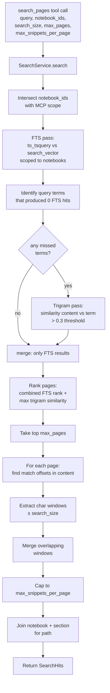
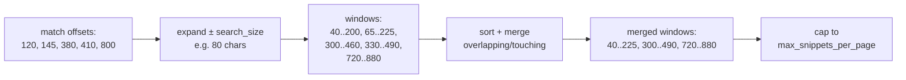

# Search Service Plan

Implement the page search that powers the MCP `search_pages` tool. Combines Postgres FTS (precise, fast) with `pg_trgm` fuzzy similarity (handles OCR errors), returns tagged character-window snippets capped at sane defaults to keep MCP responses small.

---

## Why

OCR'd content has predictable errors (`painters` for `Pointers`, `Ivalve` for `lvalue`). Pure FTS misses these. Pure embeddings would handle them but adds infrastructure and produces unreliable vectors on garbled input. Postgres FTS + trigram together cover the same ground with zero new infrastructure:

| layer | catches | speed |
|---|---|---|
| FTS (`ts_rank_cd` on `search_vector`) | exact + stemmed matches in typed text and well-OCR'd words | fast (GIN index) |
| Trigram (`similarity(content, term)`) | OCR-mangled words sharing trigrams with the query | fast (GIN with `gin_trgm_ops`) |

The service returns short character windows (defaults: 80 chars on each side, 5 snippets per page, 10 pages per query — ~2 K tokens total). This keeps the calling LLM's context footprint small even when the search hits many pages.

---

## Architecture



---

## Schema Migration

### New Alembic migration

```python
def upgrade() -> None:
    op.execute("CREATE EXTENSION IF NOT EXISTS pg_trgm")
    op.execute(
        "CREATE INDEX ix_pages_content_trgm "
        "ON pages USING gin (content gin_trgm_ops)"
    )

def downgrade() -> None:
    op.execute("DROP INDEX IF EXISTS ix_pages_content_trgm")
    # leave pg_trgm in place — may be used by other indexes
```

Add to `app/models.py` Page `__table_args__` (for SQLAlchemy awareness, optional but cleaner):
```python
Index("ix_pages_content_trgm", "content", postgresql_using="gin", postgresql_ops={"content": "gin_trgm_ops"}),
```

Verify after migration:
```sql
EXPLAIN ANALYZE
SELECT id, similarity(content, 'pointers') AS s
FROM pages
WHERE content % 'pointers'
ORDER BY s DESC LIMIT 10;
-- expect: Bitmap Index Scan on ix_pages_content_trgm
```

---

## File-by-File Changes

### `alembic/versions/<new_revision>_add_pg_trgm.py`

New migration as shown above. Bumps revision chain after the latest existing migration.

### `app/models.py`

Add the trigram index to `Page.__table_args__` alongside the existing GIN index.

### `app/schemas.py`

```python
class SearchSnippet(BaseModel):
    text: str
    start_offset: int  # byte offset into pages.content where the window starts

class SearchHit(BaseModel):
    page_id: int
    page_title: str | None
    section_name: str
    notebook_id: int
    notebook_name: str
    snippets: list[SearchSnippet]
    stale: bool  # true if any of the page's sync_status / notebook sync_status flags staleness
```

### `app/repositories/page_repository.py`

Add:

```python
async def search_fts(
    self,
    notebook_ids: list[int],
    query: str,
    limit: int,
) -> list[tuple[int, float, str]]:
    """Returns (page_id, ts_rank, content) for pages whose search_vector matches query."""

async def search_trgm(
    self,
    notebook_ids: list[int],
    terms: list[str],
    threshold: float,
    limit: int,
) -> list[tuple[int, float, str]]:
    """Returns (page_id, max_similarity, content) for pages where any term is similar to content."""

async def get_pages_with_path(
    self,
    page_ids: list[int],
) -> dict[int, PageWithPath]:
    """Returns page_id -> (page_title, section_name, notebook_id, notebook_name, sync_status, notebook_sync_status)."""
```

The first two queries should select content directly so the service can extract snippets without a second round trip.

### `app/services/search_service.py` (new)

```python
class SearchService:
    def __init__(self, page_repo: PageRepository) -> None:
        self._pages = page_repo

    async def search(
        self,
        query: str,
        notebook_ids: list[int],
        search_size: int = 80,
        max_pages: int = 10,
        max_snippets_per_page: int = 5,
    ) -> list[SearchHit]:
        ...
```

Algorithm in seven steps (matches the architecture diagram):

1. **Validate + clamp params** — `search_size ≤ 250`, `max_pages ≤ 20`, `max_snippets_per_page ≤ 10`.
2. **FTS pass** — call `search_fts(notebook_ids, query, limit=max_pages * 3)` for a bigger candidate pool than the cap (so trigram boosts can compete).
3. **Detect missed terms** — split query into terms (whitespace-split, drop FTS operators). For each term, check if any FTS hit's content contains it (case-insensitive substring). Terms with zero hits go to step 4.
4. **Trigram fallback** — `search_trgm(notebook_ids, missed_terms, threshold=0.3, limit=max_pages * 3)`.
5. **Merge + rank** — combine page IDs from both passes. Score = FTS rank + 0.5 × max trigram similarity (weights TBD; FTS dominates ties).
6. **Top max_pages** — take top-N by combined score.
7. **Build snippets per page** — for each page, find all match offsets (case-insensitive substring scan against each query term), build `[max(0, off - search_size), min(len, off + len(term) + search_size)]` windows, sort, merge overlapping/touching, take top `max_snippets_per_page` (longer windows first).
8. **Resolve paths** — `get_pages_with_path` to fetch notebook + section names + staleness flags for the survivors. Return `SearchHit` list.

### Snippet window merge



Two windows overlap iff `start_b ≤ end_a`; merge → `(start_a, max(end_a, end_b))`.

---

## Acceptance Criteria

- [ ] Alembic upgrade enables `pg_trgm` and creates `ix_pages_content_trgm`
- [ ] `EXPLAIN ANALYZE` on a trigram query uses the new index (Bitmap Index Scan)
- [ ] Repository methods `search_fts`, `search_trgm`, `get_pages_with_path` exist and return Pydantic-typed results
- [ ] `SearchService.search` returns at most `max_pages` pages, at most `max_snippets_per_page` snippets per page
- [ ] Searching for `pointers` against the CS246 test page returns snippets that include the OCR'd word `painters` (fuzzy match working)
- [ ] Searching for an FTS-friendly term (`overloading`, `references`) returns matches without trigram fallback firing (verifiable in logs)
- [ ] Notebook scope is honored: searches respect the intersection of caller's `notebook_ids` and the MCP connection's allowed notebooks
- [ ] Staleness flag on `SearchHit` is true when the page or its notebook has `sync_status` other than `fresh`

---

## Open Questions

| question | proposed answer |
|---|---|
| Trigram similarity threshold | Start at 0.3. Re-tune based on real queries. |
| FTS vs trigram score weighting | FTS rank + 0.5 × trigram similarity. Refine if FTS hits get out-ranked by noise. |
| How to detect "FTS missed this term" | Substring scan of returned content. Cheap, no extra query. |
| Multi-word query handling for trigram | Run trigram per-term, take page's max similarity across all missed terms. Simpler than building n-grams. |
| Title weighting | None for V1 (deferred — small expected gain for added complexity). |

---

## Notes

- This plan does **not** include the FastMCP tool wiring. The `search_pages` tool that calls this service is in `mcp-server-plan.md`.
- Snippet `start_offset` is included so future versions can grow the window client-side (e.g. "show me more around the second snippet of page 42").
- The trigram threshold is the single most likely thing to need tuning post-launch.
