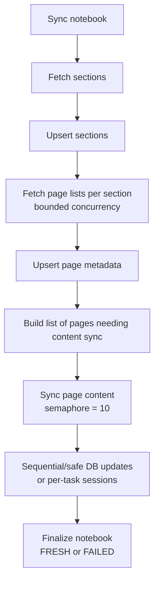

# Sync Parallelization Plan

Speed up notebook sync by parallelizing the expensive per-page work with a bounded semaphore, starting at **10 concurrent pages**. This should improve both manual web syncs (`POST /api/notebooks/{id}/sync`) and the automatic/full sync path, because both use `SyncService`'s shared notebook/section/page sync internals.

---

## Why

The current sync flow is mostly serial:

1. Fetch sections for one notebook.
2. For each section, fetch pages.
3. For each page, fetch content, images, InkML, build a composite, optionally OCR it, then update the DB.

The only parallel work today is image fetching *inside one page*. That leaves the expensive unit, page content sync, running one page at a time. A first sync of a real notebook can therefore take several minutes even when each individual page is only a few seconds.

The best parallelization unit is the **page**, not the section:

| Stage | Parallelization value | Notes |
|---|---:|---|
| sections | medium | Helpful for page-list discovery, but section sizes are uneven. One section may contain most pages. |
| pages | high | Page content fetch, image fetch, OCR, and content assembly are independent per page. |
| images within a page | already done | Existing `asyncio.gather` fetches page images concurrently. |
| notebooks | later | Automatic sync may include multiple notebooks, but page-level concurrency benefits both manual and automatic paths first. |

---

## Target Architecture



---

## Concurrency Strategy

### Start with page content concurrency = 10

Add a configurable limit to `SyncService`, defaulting to:

```python
page_content_concurrency: int = 10
```

Use `asyncio.Semaphore(10)` around page content workers. This gives a large first-sync speedup without fully unbounded Graph/Vision load.

### Also parallelize section page-list discovery

Fetching `/sections/{id}/pages` is metadata-only and cheaper than page content/OCR. Use bounded concurrency here too, likely the same default of `10` unless tests show Graph throttling.

```python
page_metadata_concurrency: int = 10
```

This is useful but secondary. The main runtime win is page content concurrency.

---

## DB Session Rule

SQLAlchemy `AsyncSession` is not safe for concurrent use across multiple asyncio tasks. Do **not** have 10 page workers all call the same repository/session at the same time.

Use one of these safe patterns:

| Pattern | Recommendation | Tradeoff |
|---|---|---|
| Fetch/compute concurrently, then DB update sequentially | Best first implementation | Simple and safe; DB writes remain ordered and low-risk. |
| One DB session per page worker | Possible later | More complex; higher DB connection pressure; useful only if sequential writes become the bottleneck. |

Recommended V1:

1. Page workers do Graph/OCR/composite work concurrently.
2. Each worker returns a result object.
3. The parent task applies DB updates sequentially with the existing session.
4. Keep the current background progress commits after each page update.

This keeps most of the speedup while avoiding concurrent session misuse.

---

## Proposed Internal Shape

### New internal result model

Add an internal Pydantic model. Keep it near the sync service unless it becomes shared outside the service; if it becomes a cross-module contract, move it to `schemas.py`.

```python
class PageContentSyncResult(BaseModel):
    page_id: int
    content: str | None = None
    content_hash: str | None = None
    sync_status: PageSyncStatus = PageSyncStatus.FRESH
    error_message: str | None = None
```

Use `error_message` instead of storing an exception object so the model stays serializable and easy to log/test.

### Split page content sync into compute vs persist

Current `_sync_page_content(page, access_token)` both fetches/does OCR and writes to DB. Split it:

```python
async def _build_page_content_update(page, access_token) -> PageContentSyncResult:
    ...

async def _apply_page_content_result(result) -> None:
    ...
```

Then `_sync_section` can gather work safely:

```python
semaphore = asyncio.Semaphore(self._page_content_concurrency)

async def run_one(graph_page, db_page):
    async with semaphore:
        return await self._build_page_content_update(db_page, access_token)

results = await asyncio.gather(*(run_one(graph_page, db_page) for graph_page, db_page in to_sync))

for result in results:
    await self._apply_page_content_result(result)
    await self._checkpoint()
```

### Progress behavior

Keep the recent progress-commit behavior:

- Commit after notebook enters `SYNCING`.
- Commit after page metadata is upserted.
- Commit after each page content result is applied.
- Commit final notebook `FRESH`/`FAILED`.

This means the UI/DB can show real progress during large syncs.

---

## Handling Failures

The current behavior marks individual pages `FAILED` when content sync fails and lets the notebook finish. Preserve that.

With concurrent workers:

- Use `asyncio.gather(..., return_exceptions=False)` only if `_build_page_content_update` catches per-page exceptions and returns a failed result.
- Prefer per-page failures over aborting the whole notebook.
- Keep outer notebook-level `FAILED` for structural failures like no connection, no token, or failure fetching sections/pages metadata.

Suggested behavior:

| Failure | Result |
|---|---|
| One page content/OCR fails | Page becomes `FAILED`; notebook can still become `FRESH` after the run. |
| Graph cannot list sections | Notebook becomes `FAILED`. |
| Graph cannot list pages for a section | Notebook becomes `FAILED` for now; later we can make section-level partial failure if needed. |
| Microsoft token expired | Connection flips to `NEEDS_REAUTH`; notebook becomes `FAILED`. |

---

## Rate Limits And Tuning

Start at `10`, but make it easy to tune downward if Graph or Vision throttles.

Implementation options:

1. Constructor defaults only:
   ```python
   SyncService(..., page_content_concurrency=10)
   ```
2. Settings-backed defaults:
   ```python
   SYNC_PAGE_CONTENT_CONCURRENCY: int = 10
   SYNC_PAGE_METADATA_CONCURRENCY: int = 10
   ```

Recommended: settings-backed defaults so local testing can use `10`, and deployment can lower it without code changes.

If throttling appears, reduce to `5` or `3`. The Graph client already retries retryable status codes (`429`, `502`, `503`, `504`), but Vision cost/latency should also be watched.

---

## File-by-File Changes

### `backend/app/core/config.py`

Add optional settings:

```python
SYNC_PAGE_CONTENT_CONCURRENCY: int = 10
SYNC_PAGE_METADATA_CONCURRENCY: int = 10
```

### `backend/app/services/sync_service.py`

Add:

- constructor args for metadata/content concurrency
- an internal `PageContentSyncResult`
- split page content sync into build/apply methods
- bounded concurrent page content workers
- optionally bounded concurrent page-list discovery
- progress logging, e.g. `Synced 12/73 pages for section 'X'`

### `backend/sync/run.py`

No required behavior change if settings defaults are used. Optional CLI flags later:

```bash
python -m sync.run --notebook-id 40 --page-concurrency 10
```

### `backend/app/routers/notebooks.py`

No route contract change. Manual web sync benefits through shared service internals.

---

## Acceptance Criteria

- [ ] Manual sync still returns `202` immediately and shows notebook `SYNCING` via `GET /api/notebooks`.
- [ ] During a large sync, DB rows for sections/pages/content continue to become visible incrementally.
- [ ] Page content sync runs with a semaphore default of `10`, never unbounded.
- [ ] The same `AsyncSession` is not used concurrently by multiple page workers.
- [ ] Per-page failures mark only that page `FAILED`; other pages continue.
- [ ] Automatic/full sync path benefits from the same page-level concurrency.
- [ ] A live sync of `AFM 132` is materially faster than the previous roughly 5-minute first sync, or logs clearly show the new bottleneck.
- [ ] Logs include enough progress to see throughput and stuck pages without querying Postgres manually.

---

## Test Plan

1. Run static check:
   ```bash
   python -m py_compile app/services/sync_service.py app/core/config.py
   ```

2. Reset or choose a notebook with enough pages to measure meaningfully.

3. Trigger manual sync:
   ```bash
   curl -i -X POST http://127.0.0.1:8000/api/notebooks/40/sync \
     -H "Authorization: Bearer <token>"
   ```

4. Watch DB progress:
   ```sql
   select n.sync_status, count(p.id) pages,
          count(*) filter (where p.sync_status = 'FRESH') fresh_pages,
          count(*) filter (where p.sync_status = 'FAILED') failed_pages
   from notebooks n
   left join sections s on s.notebook_id = n.id
   left join pages p on p.section_id = s.id
   where n.id = 40
   group by n.sync_status;
   ```

5. Confirm final state:
   ```sql
   select sync_status, last_synced_at, last_modified_datetime
   from notebooks
   where id = 40;
   ```

6. Compare rough runtime against the previous observed first sync of about 5 minutes.

---

## Open Questions

| Question | Proposed answer |
|---|---|
| Is `10` too high for Vision OCR cost/latency? | Start at `10`, make settings configurable, lower if throttling or cost spikes. |
| Should notebook-level final status be `FRESH` if some pages failed? | Keep existing behavior for now: page failures are page-level; notebook finalizes after the run. |
| Should automatic sync parallelize notebooks too? | Defer. Page-level concurrency gives both flows the main win with less scheduling complexity. |
| Should progress be exposed through an endpoint? | Defer. DB-backed polling already sees page counts/statuses; frontend can add richer progress later. |
