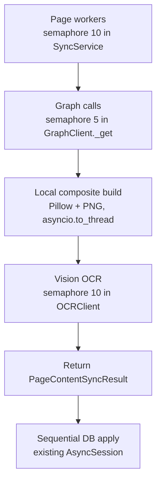

# Sync Pipeline Concurrency Plan

Refine sync parallelization into dependency-aware pipeline limits instead of one broad page semaphore. The goal is to keep first syncs fast while staying inside Microsoft OneNote/Graph limits and avoiding avoidable Railway cost spikes.

This plan supersedes the single-semaphore tuning in `plans/sync-parallelization-plan.md` for production.

---

## Why

The current implementation uses bounded page workers with a default concurrency of `10`. That speeds up first syncs, but every page worker can still make Microsoft Graph calls. Microsoft's OneNote limits are tighter than Google Vision's limits, so a single `10`-wide semaphore is not the right production shape.

Documented OneNote Graph limits for delegated context:

| Limit | Value |
|---|---:|
| Request rate | 120 requests / 1 minute / app / user |
| Hourly cap | 400 requests / 1 hour / app / user |
| Concurrent requests | 5 concurrent requests |

These limits are **per app, per user** — where "user" is the Microsoft account the access token is minted for (one `MicrosoftConnection`). Today this app serves a single Microsoft account, so the whole process shares one budget; the cap is effectively process-global. That shapes where the Graph semaphore lives (see below).

OneNote Graph resources also do not return `Retry-After` on `429`, so we should use our own exponential backoff with jitter.

Google Vision is less constrained by rate for this workload:

| Limit / price | Value |
|---|---:|
| Text / Document Text Detection quota | 1,800 requests / minute |
| Free tier | first 1,000 units / month |
| Paid tier | $1.50 / 1,000 units up to 5M / month |

The Vision quota is **per GCP project** — process-global, not per user. That shapes where the Vision semaphore lives.

Vision OCR runs in Google Cloud, so it does not materially burn Railway CPU. Railway compute is mostly used by page HTML/image fetching, Pillow composite rendering, PNG encoding, and memory held while multiple pages are in flight.

---

## Core principle: limits live with the resource, not the orchestrator

The headline change from the older plan: concurrency caps belong on the **client** that owns the limited resource, not in `SyncService`. A limit placed in the service only governs callers that go through that one code path; placed on the client it governs *every* caller (sync, MCP server, scripts) automatically, and it naturally counts the real HTTP requests rather than the method calls.

Three distinct limits, three homes:

| Limit | What it governs | Domain | Lives where |
|---|---|---|---|
| `SYNC_GRAPH_CONCURRENCY` (5) | Concurrent Microsoft Graph/OneNote HTTP requests | per Microsoft account = process-global today | **module-level semaphore in `graph_client.py`**, acquired inside `_get` |
| `SYNC_VISION_CONCURRENCY` (10) | Concurrent Google Vision OCR calls | per GCP project = process-global | **semaphore on the `OCRClient` singleton** |
| `SYNC_PAGE_WORKER_CONCURRENCY` (10) | Pages in flight through the pipeline (bounds memory + Pillow CPU) | local pipeline resource | **semaphore in `SyncService`** |

The page-worker limit is the only one that stays in the service, because it is not a property of any client — it bounds how many pages' image/composite buffers are held at once and how much Pillow work is queued. It spans Graph + Pillow + Vision + DB, so no single client owns it.

Do **not** raise Graph above `5` without a proper rate limiter and production telemetry.

---

## Why the Graph cap must be in `GraphClient._get`

Putting the Graph semaphore in `SyncService` (the old plan's `_with_graph_limit` / `_graph_*` wrapper helpers) does **not** actually cap concurrent HTTP requests at 5, because a single page worker fans out to many requests:

- `get_page_content_with_ink` makes up to **2** requests (v1.0 HTML + beta InkML), both via `_get`.
- `_fetch_page_images` runs `asyncio.gather` over **N** image URLs, each a `get_page_image` → `_get`.
- `_get_all` paginates in a loop, one `_get` per `@odata.nextLink`.

`GraphClient._get` is the single chokepoint every one of these funnels through. A semaphore there gives an accurate "5 concurrent OneNote HTTP requests" guarantee for free, and removes the need for any wrapper helpers in `SyncService`.

---

## Target Limits

Add explicit settings, remove the two old ones:

```python
SYNC_PAGE_WORKER_CONCURRENCY: int = 10   # replaces SYNC_PAGE_CONTENT_CONCURRENCY
SYNC_GRAPH_CONCURRENCY: int = 5
SYNC_VISION_CONCURRENCY: int = 10
# remove SYNC_PAGE_CONTENT_CONCURRENCY and SYNC_PAGE_METADATA_CONCURRENCY
```

`SYNC_PAGE_METADATA_CONCURRENCY` is dropped entirely. Once every Graph call is capped at 5 inside `_get`, a second semaphore around section page-list discovery is redundant (the Graph cap dominates). Section page-list fetches just `gather` and are bounded by the Graph semaphore.

This is a clean rename, not an alias — pre-production, so no backward-compat layer.

---

## Target Architecture



This keeps 10 pages moving through the pipeline without allowing more than 5 simultaneous OneNote requests, and without blocking the event loop on Pillow.

---

## Prerequisite Refactor: GraphClient owns its transport

Today `GraphClient(http_client)` *borrows* an `httpx.AsyncClient` created and closed by the caller. The lifecycle is handled correctly (each call site uses `async with httpx.AsyncClient(...)`), but the same wiring — including `timeout=30.0` — is copy-pasted across **four+ sites**: `main.py:21`, `sync/run.py:20`, `run_notebook_sync_background` (`sync_service.py:545`), and the scripts. Nobody sets `httpx.Limits`, so the pool runs on httpx's default of 100 max connections.

Invert it so `GraphClient` owns its transport. This is the one config home for timeout *and* pool limits — and pool limits need to be coherent with the Graph semaphore, which is why this lands before the concurrency work.

```python
class GraphClient:
    def __init__(self, *, timeout: float = 30.0, transport: httpx.AsyncBaseTransport | None = None) -> None:
        # Pool sized above the Graph semaphore so the semaphore is the binding cap, not httpx.
        self._client = httpx.AsyncClient(
            timeout=httpx.Timeout(timeout),
            limits=httpx.Limits(
                max_connections=settings.SYNC_GRAPH_CONCURRENCY * 2,
                max_keepalive_connections=settings.SYNC_GRAPH_CONCURRENCY,
            ),
            transport=transport,  # tests inject httpx.MockTransport(...)
        )

    async def __aenter__(self) -> "GraphClient":
        return self

    async def __aexit__(self, *exc_info) -> None:
        await self._client.aclose()
```

Every entry point collapses to one idiom and the four hand-rolled `httpx.AsyncClient(...)` blocks disappear:

```python
async with GraphClient() as graph:
    ...
```

Notes:

- This stays a per-scope object (web app holds one on `app.state` for its lifetime; CLI/background each open and close their own). It is **not** `@lru_cache`'d, because it owns a loop-bound resource with a real lifecycle. `MSALClient` and `OCRClient` stay `@lru_cache` singletons because they wrap no async lifecycle.
- Auth is already per-call (`get_notebooks(access_token)`), so one shared instance can serve every user — no client-per-user needed.
- The `transport=` parameter keeps the class construction-only and fully testable; lifecycle is just `__aenter__/__aexit__`.

---

## Implementation Shape

### Graph semaphore (in `GraphClient`)

Module-level, process-global, acquired inside the retried `_get` body:

```python
# graph_client.py, module scope
_graph_semaphore = asyncio.Semaphore(settings.SYNC_GRAPH_CONCURRENCY)

@retry(
    retry=retry_if_exception(_is_retryable),
    wait=wait_random_exponential(multiplier=1, max=60),
    stop=stop_after_attempt(_MAX_RETRIES),
    retry_error_callback=_raise_graph_api_error,
)
async def _get(self, url: str, access_token: str) -> httpx.Response:
    async with _graph_semaphore:
        response = await self._client.get(url, headers=self._headers(access_token))
        response.raise_for_status()
        return response
```

Two subtleties this placement gets right:

- **Acquire inside `_get` (the retried body), not around the call to it.** On a `429`/`5xx`, Tenacity sleeps *between* attempts, which is outside the `async with`. So a backing-off request releases its slot during the up-to-60s wait instead of holding one of the 5 the whole time. The concurrency cap bounds simultaneity; the backoff handles rate — they shouldn't fight.
- **Event-loop binding:** a module-level `asyncio.Semaphore()` binds to the loop on first `acquire`, not at import, so it is safe as long as each process runs one loop (the web app and the CLI each do, in their own process).

`GraphClient` then needs no per-call wrappers — `get_notebooks`, `get_sections`, `get_pages`, `get_page_content_with_ink`, `get_page_image`, the InkML beta call, and pagination all route through `_get` and are capped automatically.

### Vision semaphore (in `OCRClient`)

`OCRClient` is already a process singleton (`@lru_cache`), so an instance semaphore there is process-global — matching the per-project Vision quota. Add an async wrapper that acquires on the loop, then offloads the blocking gRPC call:

```python
class OCRClient:
    def __init__(self) -> None:
        self._client = vision.ImageAnnotatorClient(...)
        self._semaphore = asyncio.Semaphore(settings.SYNC_VISION_CONCURRENCY)

    async def run_ocr_async(self, image_bytes: bytes) -> str:
        async with self._semaphore:                       # acquire on the event loop
            return await asyncio.to_thread(self.run_ocr, image_bytes)
```

Keep the existing sync `run_ocr` as the implementation (scripts/tests still use it). The semaphore must be acquired in the loop thread, never inside the `to_thread` worker — `asyncio.Semaphore` is not thread-safe.

### Page-worker semaphore (stays in `SyncService`)

`_sync_page_contents` keeps a semaphore, renamed to the page-worker limit:

```python
semaphore = asyncio.Semaphore(self._page_worker_concurrency)
```

`_fetch_pages_for_sections` **drops** its local metadata semaphore and just `gather`s — section page-list fetches are now bounded by the Graph semaphore in the client.

### Composite build must not block the event loop

`_build_page_content_result` currently calls `composite_page(...)` synchronously (`sync_service.py:453`). Pillow decode/resize/paste/draw is CPU-bound and blocks the entire single-threaded event loop, which serializes all 10 page workers and is the actual Railway CPU hotspot. Offload it:

```python
composite_bytes = await asyncio.to_thread(
    composite_page, page_content.elements, image_bytes_map, page_content.ink_strokes
)
...
if composite_bytes is not None and self._ocr_client is not None:
    ocr_text = await self._ocr_client.run_ocr_async(composite_bytes)
```

### Keep DB writes sequential

Do not change this part. Page workers return `PageContentSyncResult`; the parent applies each result sequentially through the existing repository/session.

---

## Retry / Backoff

The current Graph client uses Tenacity for retryable statuses (`429`, `502`, `503`, `504`) with random exponential backoff capped at 60s and `stop_after_attempt(_MAX_RETRIES)`. Keep it — it already provides the capped, jittered, limited backoff this plan needs.

Because OneNote 429s do not return `Retry-After`, make sure the backoff is the main rate safety mechanism (the semaphore only caps simultaneity):

- random exponential wait, capped max wait, limited attempts (already in place)
- the semaphore is acquired inside `_get`, so backoff sleeps do not hold a slot (see above)
- log status code and endpoint category

Later improvement: add a token-bucket rate limiter for Graph request rate (`120/min`, `400/hour`) if users sync many notebooks often.

---

## Expected Performance

Observed local benchmark after page-level concurrency:

| Notebook | Pages | Runtime |
|---|---:|---:|
| AFM 132 | 73 | 158s |

Pipeline concurrency may or may not beat 158s locally. Its main purpose is production safety. It can still be faster than a lower single semaphore because:

- page workers remain at 10
- composite now runs in a thread, so Pillow no longer serializes the loop
- Vision/composite can proceed while Graph is capped at 5
- DB writes stay lightweight and sequential

If Graph is the dominant bottleneck, runtime may stay similar or increase slightly. That is acceptable if it avoids 429s in production.

---

## Railway Cost Notes

Railway does not run Google OCR. Railway cost exposure comes from:

- CPU during Pillow image decode/resize/paste/draw (now in a thread, still real CPU)
- memory while multiple pages hold image/composite bytes (bounded by `SYNC_PAGE_WORKER_CONCURRENCY`)
- network egress, if any external egress is billed from Railway
- Postgres service CPU/RAM/storage if hosted in Railway too

Recommended deployment controls:

- set Railway compute usage alerts and hard limits
- set service replica CPU/RAM limits after observing one full sync
- use private networking for Railway Postgres
- keep sync concurrency configurable through environment variables

---

## File-by-File Changes

### `backend/app/core/config.py`

Add `SYNC_PAGE_WORKER_CONCURRENCY`, `SYNC_GRAPH_CONCURRENCY`, `SYNC_VISION_CONCURRENCY`. Remove `SYNC_PAGE_CONTENT_CONCURRENCY` and `SYNC_PAGE_METADATA_CONCURRENCY`.

### `backend/app/clients/graph_client.py`

- Make `GraphClient` own its `httpx.AsyncClient` (timeout + `httpx.Limits`), with `__aenter__/__aexit__` and an optional `transport=` for tests.
- Add a module-level `_graph_semaphore = asyncio.Semaphore(settings.SYNC_GRAPH_CONCURRENCY)`.
- Acquire it inside `_get`.
- No per-call wrapper methods.

### `backend/app/clients/ocr_client.py`

- Add an instance `_semaphore = asyncio.Semaphore(settings.SYNC_VISION_CONCURRENCY)`.
- Add `run_ocr_async` (acquire semaphore → `asyncio.to_thread(self.run_ocr, ...)`).

### `backend/app/services/sync_service.py`

- Constructor: replace the two old concurrency args with a single `page_worker_concurrency: int = settings.SYNC_PAGE_WORKER_CONCURRENCY`. No graph/vision args (clients own those).
- `_sync_page_contents`: semaphore from `self._page_worker_concurrency`.
- `_fetch_pages_for_sections`: drop the metadata semaphore; plain `gather`.
- `_build_page_content_result`: `await asyncio.to_thread(composite_page, ...)`; OCR via `await self._ocr_client.run_ocr_async(...)`.
- `run_notebook_sync_background`: `async with GraphClient() as graph_client:` instead of building httpx by hand.

### `backend/app/main.py`, `backend/sync/run.py`, `backend/scripts/*`

Replace each `async with httpx.AsyncClient(...) as http_client: GraphClient(http_client)` with `async with GraphClient() as graph:`.

### `plans/sync-parallelization-plan.md`

Note that this plan supersedes the single-semaphore tuning for production. (Header note added at the top of this plan.)

---

## Acceptance Criteria

- [ ] `GraphClient` owns and closes its own `httpx.AsyncClient`; no entry point constructs `httpx.AsyncClient` for it.
- [ ] Page worker concurrency remains configurable and defaults to `10`.
- [ ] Microsoft Graph/OneNote HTTP requests are capped at `5` concurrent process-wide (enforced in `_get`, not by method count).
- [ ] Google Vision OCR calls are separately capped at `10` on the `OCRClient` singleton.
- [ ] Pillow composite runs in a thread, not on the event loop.
- [ ] DB writes remain sequential through one `AsyncSession`.
- [ ] Full resync of AFM 132 succeeds with 73/73 pages `FRESH`.
- [ ] Logs show enough progress to compare runtime with the 158s benchmark.
- [ ] No Graph 429s appear during a single-notebook (AFM 132) benchmark run.

---

## Open Questions

| Question | Proposed answer |
|---|---|
| Should the Graph cap be per-user instead of process-global? | Not yet. Today there is one Microsoft account, so process-global == per-user. When multiple users connect, switch to a per-connection keyed semaphore (`dict[user_id, Semaphore]`); a single global cap would over-throttle distinct accounts that each have their own budget. |
| Should Graph request rate also be token-bucket limited to 120/min? | Later if 429s appear. Start with concurrency 5 plus existing retry/backoff. |
| Should Vision concurrency be 20? | Not initially. Start at 10; raise only if Graph is not the bottleneck and Railway memory stays healthy. |
| Should page workers stay at 10? | Yes. It keeps the pipeline full while Graph is capped at 5. |
| Should automatic sync queue notebooks globally? | Later. Current scope is one `SyncService` instance; production can add a global worker queue when multi-user sync is real. |
