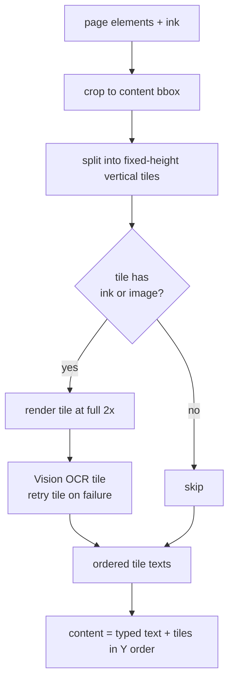

# Sync Worker Stopgap Stabilization Plan

This is a production stopgap plan for the failures seen on Railway on 2026-06-27:

- Worker OOM restarts while rendering very large OneNote page composites.
- Repeated `429 Too Many Requests` from Microsoft Graph after retries/restarts.
- STAT 230 retry loop caused by Postgres rejecting null bytes in page content.
- Page-build tasks continuing after a job failure, causing hidden background Graph/OCR work.
- Orphaned jobs being recovered later by the reaper, but only after the worker returns to its main loop.

The goal is not to redesign sync completely. The goal is to make the current production worker safe to run while we later build tiled OCR.

> **Update:** the worker has since been upgraded from the original 1 GB container to the Railway **hobby tier** (substantially more RAM). This removes the hard memory cliff that drove the original "lower the pixel cap" stopgap. The plan now keeps full OCR resolution (70 MP cap) and relies on grayscale rendering + the leak/sequential fixes instead. References to "1 GB" below describe the conditions under which the failures were originally observed.

---

## Railway Validation (2026-06-27)

Pulled the failing worker deployment's logs (commit `3c354c3d`, run ~21:52–21:59) via the Railway CLI to confirm the failure modes before patching.

- **OOM is the primary, confirmed cause.** The worker died mid-render:
  ```text
  21:57:37 composite_page: ... 3673x19057 under 70 MP Vision cap
  Bytecode compiled 4354 files ...
  21:57:39 Sync worker starting (sole Graph executor)
  ```
  There is **no graceful `Stopping Container`** between the composite line and the restart — the textbook signature of an OOM-kill, not a deploy/scale event. The reaper then requeued the orphaned job 5 as `attempt 2/5` at `21:59:40` (~2 min later, matching the 120 s lease).
- **The 70 MP cap is not an edge case — it is the norm for this data.** 15 of 22 composites in that one notebook were clamped to ~70 MP (e.g. `1568x44642` — a page 44,642 px tall). Each allocates a ~210 MB RGB canvas. On a 1 GB container this is russian roulette; the kill happened on the page that also had `2 image, 1 pdf, handwriting=True`, i.e. several large buffers live at once.
- **Task leak confirmed in code** (`_sync_page_contents`): all tasks are pre-created and the `as_completed` loop has no cancellation on exception.
- **Null-byte (0x00) failure not present in the logs I could pull** (that window covered the ECON jobs, not the STAT 230 job 7 the plan cites). The Postgres behavior is deterministic and trusted, but note it was validated by reasoning, not by a captured log line.
- **Runtime is Python 3.12.13** — `asyncio.TaskGroup` is available (see Patch 2).

---

## Immediate Containment

If production is currently burning Graph quota or repeatedly restarting, stop the worker first.

Use the worker service ID:

```powershell
railway service scale --project c62871c5-6f5c-4f6c-b2db-bf73677cf2ce --environment production --service 32527bb8-7b32-4e1e-b4e8-8c7607734c0a us-east=0
```

This stops the sync worker without deleting it. The web/API backend can stay up.

Also stop the cron service while patching, so it does not enqueue more jobs:

```powershell
railway service scale --project c62871c5-6f5c-4f6c-b2db-bf73677cf2ce --environment production --service 8a8709c9-5adb-407c-9f5e-5eeeb785a995 us-east=0
```

Only stop the web service if you want the public backend/API/MCP unavailable too:

```powershell
railway service scale --project c62871c5-6f5c-4f6c-b2db-bf73677cf2ce --environment production --service 5f733a70-9d36-456b-af82-61cae583c950 us-east=0
```

Restart later with `us-east=1` for each service.

Preferred containment order:

1. Scale worker to `0`.
2. Scale cron to `0`.
3. Leave web running unless API/MCP traffic itself is a problem.
4. Do not click "Sync" again from the UI until the stopgap patch is deployed.

---

## Confirmed Current Failure Modes

### 1. Large composite OOM

`composite_page()` currently renders a full OneNote page into one PNG, capped at 70 MP:

```python
_MAX_RENDER_PIXELS = 70_000_000
```

A near-cap RGB canvas such as `3834 x 18254` is about 210 MB for the raw canvas alone. During actual processing, memory is higher because the process also holds:

- decoded source image bytes,
- resized image copies,
- the full composite canvas,
- the PNG encode buffer,
- OCR request/response data,
- Python/Pillow overhead,
- existing SQLAlchemy/httpx/application memory.

On a 1 GB container, a single page can kill the worker even with page concurrency set to `1`.

### 2. Null byte DB failure

STAT 230 repeatedly fails at the same content point with:

```text
invalid byte sequence for encoding "UTF8": 0x00
```

Postgres cannot store `\x00` inside `text`/`varchar`, even though Python strings can contain it. The null byte can come from typed OneNote text, PDF extraction, OCR output, or merge artifacts.

This is deterministic. Retrying the job will not fix it.

### 3. Leaked page tasks after a job failure

`SyncService._sync_page_contents()` currently creates tasks for all candidate pages up front:

```python
tasks = [asyncio.create_task(build_one(candidate)) for candidate in candidates]
for task in asyncio.as_completed(tasks):
    result = await task
    await self._apply_page_content_result(result)
```

The semaphore limits how many tasks enter `build_one()` at once, but all tasks already exist.

When `_apply_page_content_result()` raises, for example from the null byte DB write, the loop exits. The remaining tasks are not cancelled. Those background tasks keep running in the event loop while the worker marks the job failed and claims another job.

Observed impact:

- STAT 230 page logs continued after job 7 failed.
- The worker then claimed CS 246 while STAT 230 page tasks were still doing Graph/PDF/OCR work.
- Effective Graph/OCR work became greater than the configured concurrency.
- This likely contributed to both memory pressure and Graph `429` escalation.

### 4. Reaper is not a real-time recovery loop

The worker runs the reaper at startup and between jobs. It does not run in the background while a long job is executing.

If a worker OOMs, the job remains `RUNNING` until its lease expires. A restarted worker may claim another pending job before the old job is reaped.

This is acceptable for correctness, but it makes recovery slower and can interleave retries in confusing ways.

---

## Stopgap Patch Set

Ship these as one small production hardening patch.

### Patch 1: Sanitize text at the Postgres write boundary

Add a small helper:

```python
import re

# Only two character classes can break a Postgres text write; strip exactly those:
#  - NUL (U+0000): valid UTF-8 but rejected by Postgres text/varchar
#    ("invalid byte sequence for encoding \"UTF8\": 0x00") — the confirmed STAT 230 bug.
#  - Lone UTF-16 surrogates (U+D800–U+DFFF): a Python str can hold these, but they have
#    no valid UTF-8 encoding, so asyncpg raises UnicodeEncodeError before the row is sent.
# Everything else (other control chars, emoji, BOM, U+FFFD) stores fine and is left intact.
_POSTGRES_UNSAFE_TEXT = re.compile(r"[\x00\ud800-\udfff]")


def _sanitize_postgres_text(value: str) -> str:
    return _POSTGRES_UNSAFE_TEXT.sub("", value)
```

**Scope confirmed empirically (2026-06-27).** The STAT 230 failure was specifically `0x00`. Testing every plausible character class against `str.encode("utf-8")` (what asyncpg does) showed that **only** NUL and lone surrogates break a write; tabs, newlines, C0 control chars, DEL, emoji, BOM, and the U+FFFD replacement char all encode and store fine. So a NUL-only strip would fix the observed bug but still leave one (low-likelihood) crash path open — the surrogate range — which is why the helper covers both. Do **not** broaden further: stripping ordinary control characters would corrupt legitimate OCR/PDF text.

**Apply it at the DB write boundary, not in `_assemble_page_content()`.** The original plan put it in `_assemble_page_content()`, which only covers page `content`. But page **titles** are written separately in `_sync_section_metadata()` (`PageCreate(title=graph_page.title)`) and also come from external Graph data. The single cleanest chokepoint is a pydantic `field_validator` on the text fields of `PageUpdate.content` and `PageCreate.title` — every write through those schemas is sanitized automatically, regardless of which call site builds them. (Sanitizing inside the repository methods is the equivalent fallback if a schema validator is undesirable.)

If a single chokepoint is awkward, the minimum viable fix is still to sanitize `content` (the confirmed culprit) in `_assemble_page_content()`, but treat titles as a known remaining gap.

Why this wins:

- Covers typed OneNote text, Vision OCR text, PDF text, and future merged sources (all flow into `content`).
- Plus titles and any other externally-sourced text column, at one boundary.

Add a focused test:

- `_sanitize_postgres_text("abc\x00def")` drops the NUL.
- `_sanitize_postgres_text("a\ud800b")` drops the lone surrogate and the result `.encode("utf-8")` succeeds.
- Normal text (incl. tabs, newlines, emoji) is unchanged.

### Patch 2: Stop leaking page tasks

Change `_sync_page_contents()` so a failure cancels outstanding tasks.

Minimum safe patch:

```python
tasks = [asyncio.create_task(build_one(candidate)) for candidate in candidates]
try:
    completed = 0
    for task in asyncio.as_completed(tasks):
        result = await task
        completed += 1
        await self._apply_page_content_result(result)
        logger.info(...)
except Exception:
    for task in tasks:
        task.cancel()
    await asyncio.gather(*tasks, return_exceptions=True)
    raise
```

Better stopgap patch:

- If `self._page_worker_concurrency <= 1`, do not create tasks at all.
- Process candidates sequentially in a simple `for` loop.
- Use a task-based path only when concurrency is greater than `1`, with cancellation protection.

Why this is better:

- Production currently uses concurrency `1`.
- Sequential code is easier to reason about.
- No hidden background tasks can survive job failure.
- It reduces memory pressure immediately.

**Critical invariant the original plan did not name — the shared `AsyncSession`.** `_apply_page_content_result()` calls `self._session.commit()`, and a single SQLAlchemy `AsyncSession` is **not safe for concurrent use**. Today this only works because the applies happen serially in the main loop, never inside the concurrent `build_one` tasks. The sequential `for` loop preserves this naturally. Do **not** "fix" the leak by moving `_apply_page_content_result` into the tasks without also serializing DB access (a lock) — that trades a task leak for session corruption.

**For the concurrency > 1 path, prefer `asyncio.TaskGroup`** (available on the 3.12.13 runtime) over the manual `try/except: cancel + gather` shown above. `TaskGroup` auto-cancels sibling tasks when one raises — it is precisely the primitive the manual cancel/gather is reimplementing, and it gets the edge cases right. Keep result-application in the awaiting loop (or behind a lock) to honor the session invariant above.

Stopgap recommendation: ship the sequential path for `concurrency == 1` (production) now; leave the `> 1` path on `TaskGroup` for when concurrency is actually raised.

### Patch 3: Render the composite in grayscale — keep the 70 MP cap

The original plan attacked memory by lowering the pixel cap on an **RGB** canvas, which costs OCR quality (fewer pixels per character on tall pages). The higher-leverage move is to change the canvas *mode* instead, because OCR is luminance-only — Google Vision ignores color. So **grayscale rendering is lossless for OCR** and cuts the dominant memory term 3×, independent of resolution.

**Decision: apply grayscale only; do NOT lower `_MAX_RENDER_PIXELS`.** With the Railway upgrade to the **hobby tier** (much larger per-service RAM than the original 1 GB container this plan was written against), grayscale alone is more than enough headroom, and there is no need to take any OCR-quality hit. The pixel cap stays at the current 70 MP.

Render the canvas as mode `"L"` (1 byte/pixel) instead of `"RGB"` (3 bytes/pixel):

```python
canvas = Image.new("L", (canvas_width, canvas_height), "white")  # was "RGB"
...
image = Image.open(io.BytesIO(raw_image)).convert("L")           # was .convert("RGB")
```

**Minimal-diff note (verified):** the `"white"`/`"black"` color names already resolve to `255`/`0` in mode `L`, so the existing ink draws — *both* `draw.line(..., fill="black", ...)` **and** the single-point `draw.ellipse(..., fill="black")` — need **no change**. The only required edits are the canvas `mode` and the per-image `.convert(...)`. `canvas.paste()` of an `L` image onto an `L` canvas works, and `convert("L")` drops alpha exactly as `convert("RGB")` did today (no transparency compositing either way), so embedded RGBA/palette images behave identically. The `L` canvas PNG-encodes normally for Vision.

Memory comparison (canvas bytes only):

| Mode + cap | Bytes/px | Max canvas | OCR resolution vs today |
|---|---|---|---|
| RGB @ 70 MP (today) | 3 | **210 MB** | baseline (OOMs on 1 GB) |
| RGB @ 30 MP (original plan) | 3 | 90 MB | **much lower** — throws away handwriting detail |
| **Grayscale @ 70 MP (this plan)** | 1 | **70 MB** | **identical to today — no OCR impact** |

Two separate knobs, only one of which touches quality:

- **Mode (`L` vs `RGB`)** — pure memory win, **no OCR quality cost.** Color carries no information Vision uses. **This is the only change we make.**
- **Pixel cap (`_MAX_RENDER_PIXELS`)** — the *only* knob that affects OCR quality, because it sets how many pixels-per-character a tall page gets. **Left at 70 MP.** Revisit only if memory ever becomes a problem again on hobby tier (it should not).

Net effect: a 3× cut in canvas memory (210 MB → 70 MB at the max) with **zero** change to OCR output. Combined with sequential processing (Patch 2) and prompt image close (Patch 4), peak worker memory drops well under the hobby-tier limit.

Also convert pasted source images and ink draw colors to the `L` space (shown above) so the paste/draw operations match the canvas mode.

### Patch 4: Reduce image duplication inside `composite_page()`

Inside the image loop, make sure temporary PIL images are closed promptly:

```python
with Image.open(io.BytesIO(raw_image)) as opened:
    image = opened.convert("L")   # L to match the grayscale canvas from Patch 3
...
canvas.paste(image, ...)
image.close()
```

This does not solve the full-page canvas issue, but it reduces peak and retained memory around large embedded images.

### Patch 5: Keep Graph retry/cooldown logs informational

Keep the existing uncommitted logging cleanup:

- worker/cron `logging.basicConfig(..., stream=sys.stdout)`
- `graph_cooldown` from warning to info
- `graph_retry` from warning to info

This does not change behavior, but makes Railway logs easier to read. Terminal job failures should remain errors.

### Patch 6: Reduce per-request Graph retries to 3

Lower the per-request retry budget:

```python
_MAX_RETRIES = 3
```

Current behavior allows up to 15 failed Graph attempts for a single request. In the API refresh logs on 2026-06-27, `GET /me/onenote/notebooks` hit repeated `429 Too Many Requests`, reached cooldown level 8, then kept probing until a later attempt finally succeeded. That is useful for eventual success, but it is too aggressive while production is already recovering from a sync storm.

For the stopgap, fail a single Graph request after 3 failed probes and let the higher-level path handle recovery:

- background sync jobs already have job-level retry/backoff,
- manual API refresh can fail quickly instead of holding the HTTP request open for minutes,
- Graph receives fewer repeated probes during a throttled period,
- the cooldown logic still spaces those 3 attempts and still honors `Retry-After`.

Do **not** lower `_COOLDOWN_MAX_LEVEL` for this purpose. Cooldown level controls how long the app waits between probes; lowering it would make probes more frequent. `_MAX_RETRIES` is the correct knob for limiting how many times one Graph request is allowed to retry.

---

## Retry Amplification (cost issue the original plan missed)

The Railway logs showed job 5 OOM, get requeued, and re-claimed as `attempt 2/5`. Because the notebook never reaches `FRESH` on failure, `last_synced_at` stays `NULL`, so the retry **re-syncs every page from scratch** — re-fetching all pages and re-running all PDF extraction and Vision OCR for pages that already succeeded, then hitting the same killer page and OOMing again, up to 5×.

So a *deterministic* OOM (or null-byte) failure does not merely fail — it burns roughly **5× Graph quota and 5× OCR cost per affected notebook** before giving up. This is a strong argument that:

1. The OOM must be *actually fixed* (grayscale rendering + the hobby-tier headroom), not just made retryable. Patches 1 and 3 target the deterministic failures directly, which is what stops the amplification.
2. It is worth considering, separately, whether OOM-class / deterministic failures should consume fewer retries than transient ones (e.g. Graph 429), so a permanently-too-big page does not cost a full 5× notebook reprocess. Out of scope for the immediate stopgap, but note it.

---

## Deployment Order

1. Scale worker to `0`.
2. Scale cron to `0`.
3. Implement patches 1-6.
4. Run local tests:
   - sync service unit tests if present,
   - targeted null-byte test,
   - `python -m compileall` or AST parse for changed backend files.
5. Commit and push.
6. Let Railway deploy web/worker images.
7. Keep worker scaled to `0` until the deploy is complete.
8. Scale worker back to `1`.
9. Watch logs for:
   - no leftover STAT 230 logs after a job failure,
   - no `invalid byte sequence for encoding "UTF8": 0x00`,
   - memory comfortably under the hobby-tier limit (with grayscale, peak canvas is ~70 MB instead of ~210 MB),
   - no repeated worker restarts.
10. Scale cron back to `1` only after manual sync looks stable.

---

## Post-Deploy Job Cleanup

After the patch deploys, the existing failed/running jobs may need cleanup.

Preferred behavior:

- Let the reaper recover expired `RUNNING` jobs.
- Let retryable jobs retry naturally.

If jobs are terminally failed due only to the old null-byte bug, requeue them manually after the patch. Do not wipe the database unless the goal is a clean fresh production test.

Before doing manual SQL, inspect `sync_jobs`:

```sql
select id, kind, notebook_id, status, attempts, max_attempts, next_run_at, last_error
from sync_jobs
order by id;
```

Then decide whether to requeue only the affected jobs.

---

## What This Does Not Fix

This stopgap does not change the one-giant-PNG composite path. It keeps a single Vision call per page, just rendered in grayscale. The longer-term option below is **segmented (tiled) OCR**.

### Future: Segmented / Tiled OCR Architecture

OneNote pages scroll vertically and can be enormous (production has a `1568x44642` page — ~14 ft tall). Today `composite_page()` renders the whole thing into one canvas and clamps the render scale down so the canvas fits Vision's ~70 MP cap. The proposed architecture instead processes the page in horizontal bands:

1. **Crop to content first.** Compute the bounding box of all content (ink-stroke extents + image rects — data we already have) and discard empty margins before anything else. Tall pages often have large blank gutters; cropping alone shrinks total work.
2. **Split into vertical tiles.** Cut the cropped canvas into full-width horizontal bands of bounded pixel height, so each tile's pixel count is small and **constant regardless of page height**.
3. **Render one tile at a time** at the full target scale (`_TARGET_RENDER_SCALE = 2.0`) — no global clamp, because each bounded tile already fits Vision's cap. Render → OCR → free, so peak memory is one tile, not the whole page.
4. **Skip blank tiles geometrically.** Decide which Y-bands contain ink/images from the stroke and image coordinates *before* rendering; bands with no content are skipped entirely (no render, no Vision call).
5. **OCR each non-blank tile independently**, then **assemble text in Y order** into the page content.
6. **Retry failed tiles independently.** A Vision error/throttle on one tile retries just that tile; one bad band never fails the whole page. (Cross-*run* retry — picking up a failed tile on a later sync — requires persisting per-tile state; see the segment-store note below.)



**Honest reconciliation with the prior walkback.** Tiling was already built and *deliberately removed* — see `plans/tiling-walkback-plan.md`. Its empirical result on a 14-ft page: 2× tiled gave only **+2–3% characters at 5× the Vision API calls**, and the conclusion was that the remaining errors are "fundamental handwriting recognition limits, not resolution limits." That finding still stands and is the reason this is **not** scheduled work. Two things have changed since, though, and they reframe *when* tiling is worth it:

- **The motivation is now memory, not accuracy.** Tiling bounds peak memory to one tile independent of page height. But **Patch 3 (grayscale) already removes the memory cliff** (210 MB → 70 MB), so on hobby-tier RAM this motivation is largely spent. This is the main reason tiling is *not* needed right now.
- **The walkback measured a mildly-clamped page; production has severely-clamped ones.** That test page only clamped to `1.31x` (close to the `2.0x` target), so it had little resolution to recover — hence the marginal +2–3%. Production logs show pages clamped to **`0.46x`–`0.48x`**, i.e. ~4× *below* target. The walkback's "not worth it" result does not necessarily generalize to those: a page rendered at 0.46x has lost far more detail, and tiling would recover it. We don't have OCR numbers for that regime.

### Better idea than blanket tiling: adaptive, clamp-gated tiling

Blanket tiling is what the walkback rightly rejected — it pays 5× Vision cost on *every* page for a gain only the rare extreme pages see. The targeted version keeps today's cheap single-call path for the common case and only tiles the pages that actually need it:

- **Gate on clamp severity.** Keep the single-composite path whenever the page renders at or near full scale (e.g. effective `render_scale >= ~1.0x`). Only when a page would be clamped *below* that threshold — the severely-tall outliers — fall back to tiling. This caps the extra Vision spend to the handful of pages where resolution loss is real, directly answering the walkback's "5× on everything" objection.
- **Skip-blank makes the outliers cheap anyway.** A 14-ft handwritten page is mostly whitespace; geometric blank-skipping means even a tiled outlier is usually only a few non-blank bands, not dozens.
- **Avoid the complexity that got cut.** The walkback specifically removed PIL-histogram whitespace-aware splitting. Prefer simpler **fixed-height bands with small vertical overlap** (e.g. ~150 px) and de-duplicate the overlap at the text level (match trailing lines of tile *k* against leading lines of *k+1*), rather than reintroducing content-aware split-point detection. Fixed bands + geometric skip is most of the value at a fraction of the code.
- **Segment store only if cross-run retry is required.** In-memory per-tile retry within a single page sync needs no schema change. Persisting per-tile results (a `page_segments` table keyed by page + band index) is only warranted if you want a failed tile to resume on a *later* sync without re-OCR'ing the whole page — defer until there's evidence that matters.

**Recommendation:** do not implement tiling as part of this stopgap, and do not schedule blanket tiling at all. If handwriting OCR quality on very tall pages proves insufficient *after* grayscale ships, first re-measure OCR accuracy specifically on a `~0.46x`-clamped page (the walkback never did); only if that shows a real gap, implement the adaptive clamp-gated variant above. Otherwise the existing `get_page_image` MCP escape hatch already covers "OCR wasn't enough for this page."

Until any of that, grayscale rendering (at the unchanged 70 MP cap) plus the leak/sequential fixes are the safest production stopgap — with no OCR-quality cost.

---

## Success Criteria

The stopgap is successful when:

- STAT 230 no longer fails on `0x00`.
- Failed jobs do not leave background page tasks running.
- Worker memory stays well under the hobby-tier limit during CS 246 or STAT 230.
- Graph throttling cools down instead of escalating across jobs.
- The worker can finish a large notebook without restarting.
