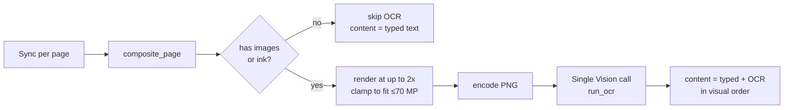
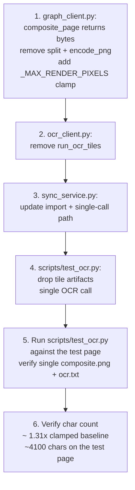

# Tiling Walk-Back Plan

Revert the tile-and-parallel-OCR pipeline added during accuracy experimentation. Restore single-Vision-call-per-page with adaptive render scaling.

---

## Why

Empirical results from `scripts/test_ocr.py` on a 14-foot lecture-notes page:

| approach | OCR chars | API calls | latency | accuracy notes |
|---|---|---|---|---|
| 1x single image | 4064 | 1 | ~1.7 s | baseline |
| 1.31x clamped single image | 4107 | 1 | ~1.7 s | +1% chars |
| 2x tiled (5 tiles) | 4192 | 5 | ~1.5 s | +3% chars, recovered "8 bytes" → "& bytes" fix |

The +2-3% character gain from tiling came with:
- 5× more Vision API calls per outlier page
- Whitespace-aware splitting code (PIL histogram-based)
- Per-tile orchestration via `asyncio.to_thread` + `asyncio.gather`
- Composite renderer returning `Image.Image` instead of `bytes`

Remaining errors are fundamental handwriting recognition limits, not resolution limits. Tiling isn't worth the complexity for V1. The MCP design now relies on `get_page_image` as the escape hatch for cases where OCR is insufficient.

---

## Target State



Single Vision call per page. No tile orchestration. Composite is rendered at up to 2x and clamped to stay under Vision's 75 MP per-image cap (currently silently downscales above that — we adaptively clamp to avoid quality loss).

---

## File-by-File Changes

### `app/clients/graph_client.py`

**Remove:**
- `split_canvas_for_ocr(...)` function
- `encode_png(image)` helper (no longer needed — composite returns bytes directly)
- Constants `_MAX_COMPOSITE_PIXELS = 250_000_000`, `_MAX_TILE_PIXELS = 30_000_000`

**Add / change:**
- Constant `_MAX_RENDER_PIXELS = 70_000_000` (under Vision's 75 MP cap with safety margin)
- `composite_page(...)` signature: `-> bytes | None` (was `Image.Image | None`)
- Inside `composite_page`: keep the adaptive scale clamp, but against `_MAX_RENDER_PIXELS`:
  ```python
  render_scale = min(
      _TARGET_RENDER_SCALE,
      math.sqrt(_MAX_RENDER_PIXELS / max(base_w * base_h, 1)),
  )
  ```
- Encode the rendered canvas to PNG inside the function and return bytes (folding the old `encode_png` step back in).

### `app/clients/ocr_client.py`

**Remove:**
- `run_ocr_tiles(self, tile_bytes: list[bytes])` method
- `import asyncio`

`run_ocr(image_bytes)` remains as the single entry point. Sync, returns `str`.

### `app/services/sync_service.py`

**Update import:**
```python
# from
from app.clients.graph_client import GraphClient, composite_page, encode_png, split_canvas_for_ocr
# to
from app.clients.graph_client import GraphClient, composite_page
```

**Simplify `_sync_page_content`:**
```python
composite_bytes = composite_page(page_content.elements, image_bytes_map, page_content.ink_strokes)
ocr_text = ""
if composite_bytes is not None and self._ocr_client is not None:
    ocr_text = await asyncio.to_thread(self._ocr_client.run_ocr, composite_bytes)
    logger.info("        Composite OCR: %d chars", len(ocr_text))
```

(Still wrap the sync Vision call in `asyncio.to_thread` so the sync loop's event loop stays responsive — that's not tiling, that's just keeping a sync SDK call non-blocking.)

### `scripts/test_ocr.py`

**Remove:**
- Tile-related code: `tiles`, `tiles_bytes`, `tile_sizes`, `tile_texts` lists
- Per-tile file writes (`tile_NN.png`, `ocr_tile_NN.txt`)
- Import of `split_canvas_for_ocr`, `encode_png`
- Tile-related keys in `meta` dict (`tile_count`, `tile_sizes`, `tile_ocr_chars`)

**Restore:**
- `composite_bytes = composite_page(...)` directly returns bytes
- Single call: `ocr_text = await asyncio.to_thread(get_ocr_client().run_ocr, composite_bytes)`
- Write only `composite.png` and `ocr.txt`

---

## Migration Steps



---

## Acceptance Criteria

- [ ] `app/clients/graph_client.py` exports only `composite_page` (returning `bytes | None`) — no `split_canvas_for_ocr`, no `encode_png`
- [ ] `app/clients/ocr_client.py` exposes only `run_ocr(image_bytes) -> str`
- [ ] `sync_service._sync_page_content` performs exactly one Vision call per page (verifiable in logs)
- [ ] `scripts/test_ocr.py` writes `composite.png` + `ocr.txt` only (no `tile_*.png` / `ocr_tile_*.txt`)
- [ ] Test page (CS246 / page id 77) runs end-to-end with no tiling code paths exercised
- [ ] OCR output is within ~5% of the prior 1.31x-clamped baseline (~4100 chars)

---

## Notes

- Wrapping `run_ocr` in `asyncio.to_thread` from the sync service is **not** tiling — it's the standard pattern for calling a sync SDK from an async function. Keep it.
- The `_TARGET_RENDER_SCALE = 2.0` constant stays. Only the cap value changes (250 MP composite + 30 MP tile → single 70 MP cap).
- No DB or schema changes in this plan.
