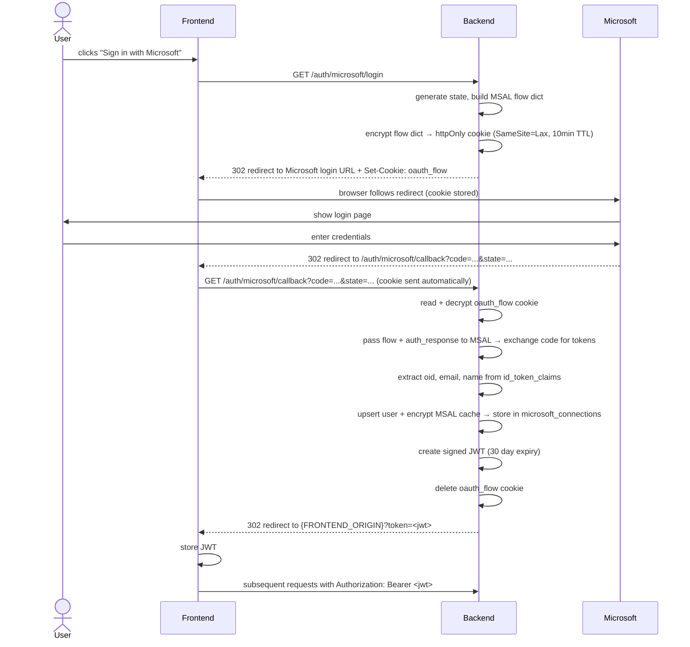

# Todo

## Auth Flow

---

## Done
- [x] Models (`app/models.py`)
- [x] Schemas (`app/schemas.py`)
- [x] Repositories (`app/repositories/`)
- [x] Alembic migration (initial)
- [x] Core config (`core/config.py`)
- [x] Core database (`core/database.py`)
- [x] Core exceptions (`core/exceptions.py`)
- [x] Core auth (`core/auth.py`) — JWT create + FastAPI dependency
- [x] Core encryption (`core/encryption.py`) — Fernet encrypt/decrypt
- [x] Client — MSAL (`clients/msal_client.py`)
- [x] Client — Graph API (`clients/graph_client.py`)
- [x] Client — OCR / Surya (`clients/ocr_client.py`)
- [x] `services/auth_service.py` — OAuth flow, JWT
- [x] `routers/auth.py` — login, callback, disconnect
- [x] `main.py` — lifespan, routers, CORS

---

## Up Next

### Azure app registration
- [ ] Create app in Azure portal (confidential client, web)
- [ ] Add redirect URI: `http://localhost:8000/auth/microsoft/callback`
- [ ] Add delegated permissions: `User.Read`, `Notes.Read`, `offline_access`, `openid`, `profile`, `email`
- [ ] Generate client secret
- [ ] Account type: common endpoint (personal + work accounts)
- [ ] Copy client ID + secret into `.env`

### Sync
- [x] `services/sync_service.py` — full sync logic (composite + single OCR call via Vision)
- [x] `sync/run.py` — standalone entrypoint
- [x] `scripts/test_ocr.py` — single-page composite + OCR inspection harness
- [ ] Remove tiling code from `graph_client.py` / `ocr_client.py` / `sync_service.py` / `scripts/test_ocr.py` (revert to single-image composite + single Vision call)

### Schema migration (fuzzy search)
- [ ] New Alembic migration: enable `pg_trgm` extension (`CREATE EXTENSION IF NOT EXISTS pg_trgm`)
- [ ] Add `ix_pages_content_trgm` — GIN index with `gin_trgm_ops` on `content`

### Test end-to-end sync
- [ ] Start local Postgres (`docker compose up -d`)
- [ ] Run migrations (`alembic upgrade head`)
- [ ] Start app (`uvicorn app.main:app --reload`)
- [ ] Hit `/auth/microsoft/login` in browser, complete OAuth
- [ ] Run `python -m sync.run`, verify one notebook syncs

---

## Remaining

### API routers
- [ ] `routers/me.py` — `GET /api/me`
- [ ] `routers/notebooks.py` — list notebooks, toggle `sync_enabled`
- [ ] `routers/mcp_connections.py` — create, list, revoke

### Services
- [ ] `services/notebook_service.py` — list, toggle sync_enabled
- [ ] `services/mcp_connection_service.py` — generate token, list, revoke, resolve
- [ ] `services/search_service.py` — FTS first, pg_trgm fuzzy fallback, snippet extraction (char windows around match offsets in `content`), window merging, per-page snippet cap, scoped to notebook IDs

### MCP server
- [ ] `mcp/server.py` — FastMCP server with tools:
  - [ ] `list_notebooks` — id, display_name, sync status
  - [ ] `search_pages(query, notebook_ids, search_size?, max_pages?, max_snippets_per_page?)` — required notebook_ids; returns snippets from combined `content`; defaults: search_size=80 (max 250), max_pages=10 (max 20), max_snippets_per_page=5 (max 10); tool description warns content may contain OCR errors
  - [ ] `get_page(page_id)` — returns full `content` for the page (typed + OCR text interleaved in visual order)
  - [ ] `get_page_image(page_id)` — escape hatch, returns ImageContent
  - [ ] `list_sections(notebook_id)` — sections within a notebook in scope

### Deploy
- [ ] `railway.toml` — build/start commands
- [ ] Set up Railway project (web service + cron service)
- [ ] Set up Neon Postgres
- [ ] Configure environment variables in Railway
- [ ] Deploy and smoke test
